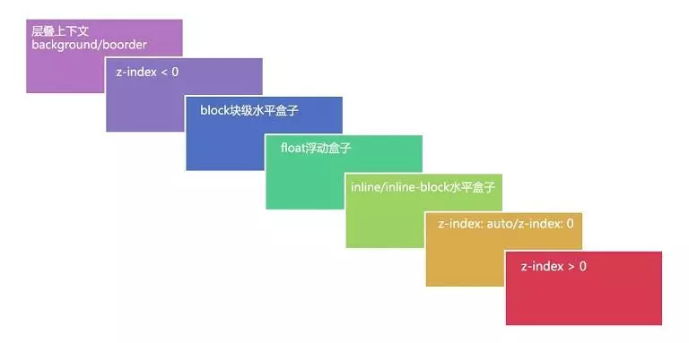

### 什么是层叠上下文？

* 层叠上下文(stacking context)，是HTML中一个三维的概念。在CSS2.1规范中，每个盒模型的位置是三维的，分别是平面画布上的X轴，Y轴以及表示层叠的Z轴。一般情况下，元素在页面上沿X轴Y轴平铺，我们察觉不到它们在Z轴上的层叠关系。而一旦元素发生堆叠，这时就能发现某个元素可能覆盖了另一个元素或者被另一个元素覆盖。

* 如果一个元素含有层叠上下文，(也就是说它是层叠上下文元素)，我们可以理解为这个元素在Z轴上就“高人一等”，最终表现就是它离屏幕观察者更近。

### 什么是层叠等级(层叠级别or层叠水平)？

* 在同一个层叠上下文中，它描述定义的是该层叠上下文中的层叠上下文元素在Z轴上的上下顺序。

* 在其他普通元素中，它描述定义的是这些普通元素在Z轴上的上下顺序。

### 如何产生层叠上下文？

1. HTML中的根元素本身就具有层叠上下文，称为“根层叠上下文”。
2. 普通元素设置position属性为非static值 并设置z-index属性为具体数值，产生层叠上下文。
   >1. fixed 定位元素和sticky定位元素
   >2. z-index不为auto 的绝对定位和相对定位元素
   >3. z-index不为auto的flex item
   >4. z-index不为auto的grid item
3. CSS3中的新属性也可以产生层叠上下文。
   >opacity小于1的元素
   >transform不为none的元素

### 什么是层叠顺序
表示元素发生层叠时按照特定的顺序规则在Z轴上垂直显示。

>* 左上角"层叠上下文background/border"指的是层叠上下文元素的背景和边框。
>* inline/inline-block元素的层叠顺序要高于block(块级)/float(浮动)元素。
>* 单纯考虑层叠顺序，z-index: auto和z-index: 0在同一层级，但这两个属性值本身是有根本区别的。

### 一些注意点
1. 首先，z-index属性值并不是在任何元素上都有效果。它仅在定位元素（定义了position属性，且属性值为非static值的元素）上有效果。
2. 判断元素在Z轴上的堆叠顺序，不仅仅是直接比较两个元素的z-index值的大小，这个堆叠顺序实际由元素的层叠上下文、层叠等级共同决定。
3. 普通元素的层叠等级优先由其所在的层叠上下文决定。

### CSS3中的属性对层叠上下文的影响
CSS3中，元素属性满足以下条件之一，就会产生层叠上下文。

1. 父元素的display属性值为flex|inline-flex，子元素z-index属性值不为auto的时候，子元素为层叠上下文元素；
2. 元素的opacity属性值不是1；
3. 元素的transform属性值不是none；
4. 元素mix-blend-mode属性值不是normal`；
5. 元素的filter属性值不是none；
6. 元素的isolation属性值是isolate；
7. will-change指定的属性值为上面任意一个；
8. 元素的-webkit-overflow-scrolling属性值设置为touch。

参考文章： https://www.zhangxinxu.com/wordpress/2016/01/understand-css-stacking-context-order-z-index/