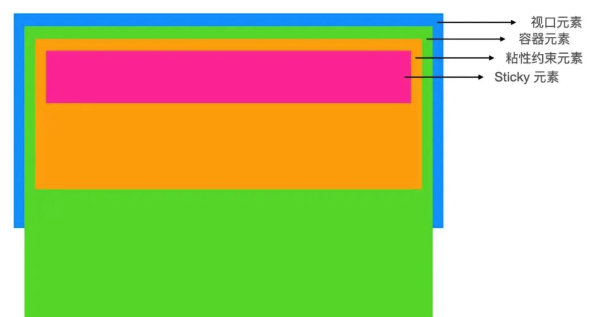
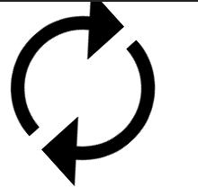
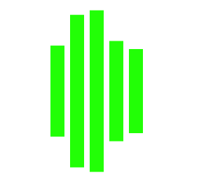
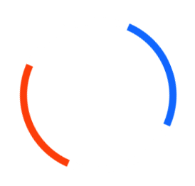
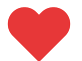

# CSS 面试题总结

#### 22. 你用 css 实现过什么不错的效果

#### 23. 你做前端有多少时间花在写 css 上（TODO）
非常多

如果说是开发阶段，我会用 20%-30% 的时间写 CSS。

比你想象的时间更少？

1. 我们开发的是一套内部的管理系统。
2. 其中一个原因是在 UI 设计时遵循了 element-ui 的规范，而开发使用的 UI 框架为 element-ui，因此大多数的界面并不需要写大量的 CSS，因为预设样式已足够使用。
3. 另外一个不得不提的原因是，针对业务场景，我们开发了一批公共组件，剩余的开发部分只需要对组件进行排列组合即可。
4. 最后是，我们的系统对动效的要求不高，不需要花费大量时间去调整动效。
#### 5. 有没有使用过 css variable，它解决了哪些问题

1. css 变量减少样式重复定义，比如同一个颜色值要在多个地方重复使用，以前通过 less 和 sass 预处理做到，现在 css 变量也可以做到，方便维护，提高可读性
    ```
    :root{
        --bgcolor: blue;
        --color: red;
    }
    p {
        color: var(--color);
    }
    div {
        backgroung-color: var(--bgcolor);
        color: var(--color)
    }
    ```

2. 在媒体查询中使用，精简代码，减少冗余
    ```
        .box {
            --base-size: 10;
            width: calc(var(--base-size)* 10px);
            height: clac(var(--base-size)* 5px);
            padding:calc(var(--base-size) * 1px);
        }
        @media screen and (min-width: 1480px) {
            .box{
                --base-size: 8;
            }
        }
    ```

3. 方便在 js 中使用
    ```
    // 设置变量
    document.getElementById("box").style.setPropertyValue('--color', 'pink')
    // 读取变量
    doucment.getElementById('box').style.getPropertyValue('--color').trim()    //pink
    // 删除变量
    document.getElementById('box').style.removeProperty('--color')
    ```
4. 可以减少 JavaScript 对 DOM 的介入，制作性能更高的动画。
5. 配合 content 等通过 CSS 给 JS 传参，得到一些通过 JavaScript 难以获取的参数。

#### 6. 谈谈你对 styled-component 的看法
styled-components 是一个针对 React 的 css in js 类库。和所有同类型的类库一样，通过 js 赋能解决了原生 css 所不具备的能力，比如变量、循环、函数等。解决了 css 全局命名空间，避免样式冲突的问题，维护起来更加方便。
```
优点
1. 贯彻 React 的 everything in JS 理念，降低 js 对 css 文件的依赖
2. 保留前端开发 CSS 书写习惯，无学习和迁移成本
3. 使用方便，不需要配置 webpack，开箱即用
4. 不用再担心样式命名的问题，移除样式与组件之间的对应关系
5. 样式可以使用变量，更加灵活
6. 组件的逻辑、生命周期、样式、结构完全和其它组件解耦，对组件维护很有帮助

缺点
可读性差，不方便直接看出组件的 html 元素
```
参考文章 https://www.jianshu.com/p/9377f25d04b0
#### 7. 使用 CSS 如何画一个三角形

* border
* linear-gradient
* clip-path

##### border

1. 设置盒子宽为0, 高为0。
```
width: 0px;
height: 0px;
```
2. 设置三角请底边边长(注意： 底边边长 = border * 2)
```
/* border是240px则三角形底边长为480px  */
border: 240px solid;
```
3. 给需要的部分设置边框颜色，不需要部分设置为透明色(transparent)
```
border-left-color: gold;
border-right-color: transparent;
border-top-color: transparent;
border-bottom-color: transparent;
```

##### linear-gradient
linear-gradient 需要结合 background-image 来实现三角形
```
.triangle {
  width: 160px;
   height: 200px;
   outline: 2px solid skyblue;
   background-repeat: no-repeat;
  background-image: linear-gradient(32deg, orangered 50%, rgba(255, 255, 255, 0) 50%), linear-gradient(148deg, orangered 50%, rgba(255, 255, 255, 0) 50%);
  background-size: 100% 50%;
  background-position: top left, bottom left;
}
```
<div style='width: 160px;
   height: 200px;
   outline: 2px solid skyblue;
   background-repeat: no-repeat;
  background-image: linear-gradient(32deg, orangered 50%, rgba(255, 255, 255, 0) 50%), linear-gradient(148deg, orangered 50%, rgba(255, 255, 255, 0) 50%);
  background-size: 100% 50%;
  background-position: top left, bottom left;'></div>


##### clip-path
它是最精简和最可具扩展性的。 不过目前其在浏览器兼容性不是很好，使用时要考虑浏览器是否支持。

```
.triangle{
  margin: 100px;
  width: 160px;
   height: 200px;
   background-color: skyblue;
  clip-path: polygon(0 0, 0% 100%, 100% 50%);
}
```
<div style='margin: 100px;
  width: 160px;
   height: 200px;
   background-color: skyblue;
  clip-path: polygon(0 0, 0% 100%, 100% 50%);'></div>

参考文章 https://zhuanlan.zhihu.com/p/482361933

#### 8. display: inline 的元素设置 margin 和 padding 会生效吗

inline 元素的 margin 与 padding 左右生效，上下生效，准确说在上下方向不会使其它元素受到挤压，仿佛不生效，如下图：

<div style='width: 500px;background-color: #ccc;height: 10rem;'>
  我是<span style='padding: 1rem;margin: 1rem;border: 1px solid red;background: skyblue;'>行内元素</span>白日依山尽，黄河入海流。白日依山尽，黄河入海流。白日依山尽，黄河入海流。白日依山尽，黄河入海流。白日依山尽，黄河入海流。
</div>

<br>

```
<div class="container">
  我是<span class="item">行内元素</span>白日依山尽，黄河入海流。白日依山尽，黄河入海流。白日依山尽，黄河入海流。白日依山尽，黄河入海流。白日依山尽，黄河入海流。
</div>

.item {
  padding: 1rem;
  margin: 1rem;
  border: 1px solid red;
  background: skyblue;
}
.container {
  width: 500px;
  background-color: #ccc;
  height: 10rem;
}
```
<br>

#### 9. html 的默认 display 属性是多少

block（块级元素）

#### 10. 响应式布局需要注意哪些问题
响应式网站设计（Responsive Web design）是一种网络页面设计布局，页面的设计与开发应当根据用户行为以及设备环境(系统平台、屏幕尺寸、屏幕定向等)进行相应的响应和调整。

##### 1、移动端字体放大问题

问题描述：当可视部分的宽度小于480px也就是iPhone横屏时的宽时。，我们需要做以下调整：

1. 禁用html节点的字号自动调整。默认情况下，iPhone会将过小的字号放大，我们可以通过-webkit-text-size-adjust属性进行调整。
2. 将main-nav中的字号设置为90%。
```
@media screen and (max-width: 480px) {
    html {
        -webkit-text-size-adjust: none;
    }
    #main-nav a {
        font-size: 90%;
        padding: 10px 8px;
    }
 } 
```

##### 2、弹性图片
我们需要为图片设置max-width: 100%和height: auto，来实现其弹性化。对于IE，仍然需要一点额外的工作：
```
img {
 max-width: 100%;
 height: auto;
 width: auto\9; /* ie8 */
}
```

##### 3、弹性视频

同样的，对于视频，我们也需要做max-width: 100%的设置；但是Safari对embed的该属性支持不是很给力，所以我们以width: 100%来代替：
```
.video embed,
.video object,
.video iframe {
    width: 100%;
    height: auto;
}
```

##### 4、兼容问题

对于那些尚不支持media query的浏览器，我们要在页面中调用css3-mediaqueries.js
```
<!--[if lt IE 9]>
 <script src="http://css3-mediaqueries-js.googlecode.com/svn/trunk/css3-mediaqueries.js"></script>
<![endif]--> 
```

##### 5、设计流程
```
1. 确定需要兼容的设备类型、屏幕尺寸
了解用户使用的设备分布情况，确定需要兼容的设备类型、屏幕尺寸。
* 设备类型：包括移动设备（手机、平板）和pc。对于移动设备，设计和实现的时候注意增加手势的功能。
* 屏幕尺寸：包括各种手机屏幕的尺寸（包括横向和竖向）、各种平板的尺寸（包括横向和竖向）、普通电脑屏幕和宽屏。

需要考虑的问题：
a. 某个页面进行响应式设计时其适用的尺寸范围是哪些？比如，1688搜索结果页面，跨度可以从手机到宽屏，而1688首页，由于结构过于复杂，想直接迁移到手机上，不太现实，不如直接设计一个手机版的首页。
b. 结合用户需求和实现成本，对适用的尺寸进行取舍。比如一些功能操作的页面，用户一般没有在移动端进行操作的需求，没有必要进行响应式设计。

2. 制作线框原型
针对确定下来的几个尺寸分别制作不同的线框原型，需要考虑清楚不同尺寸下，页面的布局如何变化，内容尺寸如何缩放，功能、内容的删减，甚至针对特殊的环境作特殊化的设计等。这个过程需要设计师和前端开发人员保持密切的沟通。

3. 测试线框原型
将图片导入到相应的设备进行一些简单的测试，可帮助我们尽早发现可访问性、可读性等方面存在的问题。

4. 视觉设计
注意，移动设备的屏幕像素密度与传统电脑屏幕不一样，在设计的时候需要保证内容文字的可读性、控件可点击区域的面积等。

5. 前端实现
与传统的web开发相比，响应式设计的页面由于页面布局、内容尺寸发生了变化，所以最终的产出更有可能与设计稿出入较大，需要前端开发人员和设计师多沟通。
```

#### 11. 对一个非定长宽的块状元素如何做垂直水平居中

```
<div class="parent">
    <div class="child">123456</div>
</div>
```

```
.parent {
    /* display: flex; */
    display: grid;
    height: 200px;
    background-color: #222;
}

.child {
    background-color: red;
    margin: auto;
}
```

<div style=" display: grid;height: 200px;background-color: #222;">
    <div style="background-color: red;margin: auto;">123456</div>
</div>

<br>

##### 总结：
```
---方法一:父级flex .container {
  display: flex;
  justify-content: center;
  align-items: center;
}

---方法二：父级grid .container {
  display: grid;
  justify-content: center;
  align-items: center;
}

---方法三：父级定位，子maigin .container {
  position: relative;
}

.container .item {
  position: absolute;
  top: 0;
  bottom: 0;
  left: 0;
  right: 0;
  margin: auto;
}

---方法四：父级定位，子位移 .container {
  position: relative;
}

.container .item {
  position: absolute;
  top: 50%;
  left: 50%;
  transform: translate(-50%, -50%);
}
```

#### 12. 如何实现左右固定，中间自适应布局

```
<div class="container" style="background-color: antiquewhite;padding: 20px;">
    <div class="left" style="background-color: aqua;">left</div>
    <div class="main" style="background-color: aquamarine;">main</div>
    <div class="right" style="background-color: pink;">right</div>
</div>
```

第一种：
```
.container {
    display: flex;
}
.left {
    width: 200px;
}
.right {
    width: 200px;
}
.main {
    flex: 1;
}
```

第二种：
```
.container {
    display: grid;
    grid-template-columns: 220px 1fr 200px;
}
```

#### 13. 如何实现表格单双行条纹样式

```
tr:nth-child(2n) {
    background-color: red;
}
tr:nth-child(2n+1) {
    background-color: blue;
}
```

```
tr:nth-child(even) {
    background: #ccc;
}
tr:nth-child(odd) {
    background: #fff;
}
```

#### 14. 简述下 css specificity（css 权重）

* 同权重： 内联样式(标签内部)> 嵌入样式表(当前文件中)>外部样式(外部文件中)
* !important > 内联 > id > class > tag
* 优先级就近原则，同权重情况下样式定义最近这位准
* 载入样式以最后载入的定位为准

> <font size=2>当然也有一些比较特殊的伪类选择器进行权重进行特殊的处理：
> 1. 选择器:is()、:not()、:has()的优先级是选择器列表中最具有复杂性的选择器的优先级取代。
> 2. 选择器:nth-child()、:nth-last-child()的优先级是伪类本身的优先级（计为一个伪类选择器，也就是计为 B），再加上选择器列表中最具复杂性的选择器的优先级。
> 3. 选择器:where()伪类的优先级被零代替，也就是没有优先级，再优先级计算中不做数。
> 4. 通用选择符以及其他选择符在优先级中不计数。</font>

#### 15. '+' 与 '~' 选择器有什么不同

```
+ 选择器匹配紧邻的兄弟元素
~ 选择器匹配随后的所有兄弟元素
```

#### 16. 有哪些 css 属性不能展示动画效果
* display
* height 

> css 不能在 display:none 和 display:block 之间进行动画，也不能在 height:0 和 height:auto 之间进行动画。

#### 17. css 动画与 js 动画哪个性能更好

CSS3 的动画： 　　
1. 在性能上会稍微好一些，浏览器会对 CSS3 的动画做一些优化（比如专门新建一个图层用来跑动画） 　　 
2. 代码相对简单 　　 
3. 在动画控制上不够灵活 　　
4. 兼容性不好 　　 
5. 部分动画功能无法实现（如滚动动画，视差滚动等） 

JavaScript 的动画： 
* 正好弥补了 css 缺点，控制能力很强，可以单帧的控制、变换，同时写得好完全可以兼容 IE6，并且功能强大。 

**总结：** 对于一些复杂控制的动画，使用 javascript 会比较好。而在实现一些小的交互动效的时候，可以多考虑 CSS。

#### 18. css 中属性选择器及类选择器的权重哪个高
一样高

#### 19. 为什么会发生样式抖动？

因为没有指定元素具体高度和宽度，比如数据还没有加载进来时元素高度是 100px(假设这里是 100px)，数据加载进来后，因为有了数据，然后元素被撑大，所有出现了抖动。

#### 20. position: sticky 如何工作，适用于哪些场景
##### 定义
position：sticky又称为粘性定位，是css3新增的。粘性定位的元素依赖于用户的滚动，在相对定位（relative）与固定定位（fixed）之间进行切换，基于位偏移的值进行偏移。

粘性定位可以被认为是相对定位和固定定位的混。
元素在跨越特定位偏移之前为相对定位，之后为固定定位。

**特点：**
1. 该元素并不脱离文档流，仍然保留元素原本在文档流中的位置。
2. 元素固定的相对偏移是相对于离它最近的具有滚动框的祖先元素，如果祖先元素都不可以滚动，那么是相对于viewport来计算元素的偏移量。
3. 当元素在容器中被滚动超过指定的偏移值时，元素在容器内固定在指定位置。亦即如果你设置了top:50px，那么在sticky元素到达距离相对定位的元素顶部50px的位置时固定，不再向上移动。
4. 元素定位表现为在跨越特定阈值前为相对定位，之后为固定定位。

**原理**
为便于理解粘性定位，这里引入四个元素：视口元素，容器元素，粘性约束元素 和 sticky 元素。它们的关系如下：


* 视口元素：显示内容的区域。会设置宽，高。一般会设置 overflow:hidden。
* 容器元素：离 sticky 元素最近的能滚动的祖先元素。
* 粘性约束元素：粘性定位的父元素。有时，也会出现粘性约束元素就是容器元素的情况。
* sticky 元素：设置了 position: sticky; 的元素。
<br>
    > 滚动时，sticky 元素设置的 left, right, top, bottom 的值相对的是容器元素。当粘性约束元素滚出视口时，sticky 元素也会滚出视口。


**不生效的情况**
1. 未指定 top, right, top 和 bottom 中的任何一个值
    * 此时，设置 position: sticky 相当于设置 position: relative。
    * 要生效，要指定 top, right, top 或 bottom 中的任何一个值。

2. 垂直滚动时，粘性约束元素高度小于等于 sticky 元素高度
   * 不生效的原因：当粘性约束元素滚出视口时，sticky 元素也会滚出视口。粘性约束元素比 sticky 元素还小，sticky 元素没有显示固定定位状态的机会。
   * 同样的，水平滚动时，粘性约束元素宽度小于等于 sticky 元素宽度时，也不会生效。

3. 粘性约束元素和容器元素之间存在 overflow: hidden 的元素

**position: sticky 适用于哪些场景？**
常作用在导航和概览信息(标题，表头，操作栏，底部评论等)上。
这样，用户在浏览详细信息时，也能看到信息的概览和做一些操作，给用户带来便捷的使用体验。

参考文章： https://blog.csdn.net/JiangLittleBai/article/details/108653463

**必须注意的点**
设置了position:sticky的元素的效果完全受制于父级元素。此外，还遵循以下条件：
<font size=2>
1. 父级元素不能有任何overflow:visible以外的overflow设置。即使是scroll或者auto也不行。
2. 父元素的高度不能低于sticky元素的高度。
3. 同一父容器中的sticky元素，如果定位置相等，则会发生重叠。
4. sticky元素如果不属于相同父元素，但是他們的父元素正好紧密相连，则会挤开原来的元素，形成依次占位的效果。
5. 必须指定top,left,bottom,right四个中的至少一个，否则其行为与相对定位相同，并且top和bottom同时设置时，top的优先级高；left和right同时设置时，left的优先级高。
</font>

#### 21. 什么是层叠上下文 (stacking contect)，谈谈对它的理解
```
层叠上下文(stacking context)，是HTML中一个三维的概念。在CSS2.1规范中，每个盒模型的位置是三维的，分别是平面画布上的X轴，Y轴以及表示层叠的Z轴。一般情况下，元素在页面上沿X轴Y轴平铺，我们察觉不到它们在Z轴上的层叠关系。而一旦元素发生堆叠，这时就能发现某个元素可能覆盖了另一个元素或者被另一个元素覆盖。
 
如果一个元素含有层叠上下文，(也就是说它是层叠上下文元素)，我们可以理解为这个元素在Z轴上就“高人一等”，最终表现就是它离屏幕观察者更近。
```

##### 1）什么是层叠等级(层叠级别or层叠水平)？
```
1.在同一个层叠上下文中，它描述定义的是该层叠上下文中的层叠上下文元素在Z轴上的上下顺序。
2. 在其他普通元素中，它描述定义的是这些普通元素在Z轴上的上下顺序。
```

##### 2）如何产生层叠上下文？

1. HTML中的根元素本身就具有层叠上下文，称为“根层叠上下文”。
2. 普通元素设置position属性为非static值 并设置z-index属性为具体数值，产生层叠上下文。
   ```
   1.fixed 定位元素和sticky定位元素
   2.z-index不为auto 的绝对定位和相对定位元素
   3.z-index不为auto的flex item
   4.z-index不为auto的grid item
   ```
3. CSS3中的新属性也可以产生层叠上下文。
   ```
   opacity小于1的元素
   transform不为none的元素
   ```

##### 3）什么是层叠顺序
<font size=2>表示元素发生层叠时按照特定的顺序规则在Z轴上垂直显示。</font>

```
1. 左上角"层叠上下文background/border"指的是层叠上下文元素的背景和边框。
2. inline/inline-block元素的层叠顺序要高于block(块级)/float(浮动)元素。
3. 单纯考虑层叠顺序，z-index: auto和z-index: 0在同一层级，但这两个属性值本身是有根本区别的。
```

##### 4）一些注意点
```
1. 首先，z-index属性值并不是在任何元素上都有效果。它仅在定位元素（定义了position属性，且属性值为非static值的元素）上有效果。
2. 判断元素在Z轴上的堆叠顺序，不仅仅是直接比较两个元素的z-index值的大小，这个堆叠顺序实际由元素的层叠上下文、层叠等级共同决定。
3. 普通元素的层叠等级优先由其所在的层叠上下文决定。
```
##### 5）CSS3中的属性对层叠上下文的影响
<font size=2>CSS3中，元素属性满足以下条件之一，就会产生层叠上下文。</font>
```
1. 父元素的display属性值为flex|inline-flex，子元素z-index属性值不为auto的时候，子元素为层叠上下文元素；
2. 元素的opacity属性值不是1；
3. 元素的transform属性值不是none；
4. 元素mix-blend-mode属性值不是normal`；
5. 元素的filter属性值不是none；
6. 元素的isolation属性值是isolate；
7. will-change指定的属性值为上面任意一个；
8. 元素的-webkit-overflow-scrolling属性值设置为touch。
```
参考文章： https://www.zhangxinxu.com/wordpress/2016/01/understand-css-stacking-context-order-z-index/

#### 24. 伪类与伪元素有什么区别
* 伪类使用单冒号，而伪元素使用双冒号。如 :hover 是伪类，::before 是伪元素
* 伪元素会在文档流生成一个新的元素，并且可以使用 content 属性设置内容

#### 25. css 如何匹配前 N 个子元素及最后 N 个子元素
* 如何匹配最前三个子元素: :nth-child(-n+3)
* 如何匹配最后三个子元素: :nth-last-child(-n+3)

#### 26. 如何使用 CSS 实现网站的暗黑模式 (Dark Mode)
```
<html lang="en" theme="dark-mode"></html>
html[theme="dark-mode"] {
    filter: grayscale(1);
}
```

参考文章： https://segmentfault.com/a/1190000023598551

#### 27. 介绍 CSS 隐藏页面中某个元素的几种方法

1. display: none
    通过 CSS 操控 display，移出文档流
    ```
    display: none;
    ```
2. opacity: 0
    透明度为 0，仍在文档流中，当作用于其上的事件(如点击)仍有效
    ```
    opacity: 0;
    ```
3. visibility: hidden
    透明度为 0，仍在文档流中，但作用于其上的事件(如点击)无效，这也是 visibility:hidden 与 opacity: 0 的区别
    ```
    visibility: hidden;
    ```
4. content-visibility
    移出文档流，但是再次显示时消耗性能低
    ```
    content-visibility: hidden;
    ```
5. 绝对定位于当前页面的不可见位置
    ```
    position: absolute;
    top: -9000px;
    left: -9000px;
    ```
6. 字体大小设置为 0
    ```
    font-size: 0;
    ```

#### 28. css 如何实现响应式布局大屏幕三等分、中屏幕二等分、小屏幕一等分？

```
<div class="container" style="width: 100%;height: 600px;background-color: antiquewhite;">
  <div class="item" style="height: 100%;background-color: aquamarine;"></div>
  <div class="item" style="height: 100%;background-color: aquamarine;"></div>
  <div class="item" style="height: 100%;background-color: aquamarine;"></div>
  <div class="item" style="height: 100%;background-color: aquamarine;"></div>
  <div class="item" style="height: 100%;background-color: aquamarine;"></div>
  <div class="item" style="height: 100%;background-color: aquamarine;"></div>
</div>
```

```
@media (min-width: 768px) {
  .container {
    grid-template-columns: repeat(2, minmax(0, 1fr));
  }
}

@media (min-width: 1024px) {
  .container {
    grid-template-columns: repeat(3, minmax(0, 1fr));
  }
}

.container {
  display: grid;
}

.conainer {
  gap: 1rem;
}
```

**总结：** Grid 布局可以自动判断容器大小，无论大小屏幕自动撑满并均分，请看以下属性
```
.container {
  grid-template-columns: repeat(auto-fill, minmax(300px, 1fr));
}
```
* repeat: 用以 N 整分
* auto-fill：表示自动填充
* minmax: 即书面意思，最小宽度为 300px

#### 29. 前端开发中如何进行多主题配置

```
<!-- html 节点添加主题自定义属性 -->
<html data-theme="light">
  <!-- 使用CSS变量控制样式 -->
	<body style="background: var(--body-background)"></body>
</html>
```

```
// 跟主题无关的变量放到root里
:root {
    --border-radius-base: 6px;
}

// 跟主题相关变量，通过属性选择器提升优先级
html[data-theme='default']:root {
    --body-background: #efefef;
}

html[data-theme='dark']:root {
    --body-background: #000;
}
```

参考文章： https://juejin.cn/post/7049384448256639006

#### 30. 如何自定义滚动条的样式

滚动条相关样式都是伪元素，以 scrollbar 打头，有以下伪元素，从 -webkit 中可见兼容性一般，不过无所谓，现在 Chrome 浏览器占大头
>
    ::-webkit-scrollbar — 整个滚动条.
    ::-webkit-scrollbar-button — 滚动条上的按钮 (上下箭头).
    ::-webkit-scrollbar-thumb — 滚动条上的滚动滑块.
    ::-webkit-scrollbar-track — 滚动条轨道.
    ::-webkit-scrollbar-track-piece — 滚动条没有滑块的轨道部分.
    ::-webkit-scrollbar-corner — 当同时有垂直滚动条和水平滚动条时交汇的部分.
    ::-webkit-resizer — 某些元素的 corner 部分的部分样式(例:textarea 的可拖动按钮).

但其实最常用的是以下几个伪元素：滚动条、滑块、轨道，如下滚动条设置成功

```
::-webkit-scrollbar {
  width: 6px;
  height: 6px;
}

::-webkit-scrollbar-track {
  border-radius: 3px;
  background: rgba(0, 0, 0);
  box-shadow: inset 0 0 5px rgba(0, 0, 0, 0.08);
}

::-webkit-scrollbar-thumb {
  border-radius: 3px;
  background: rgba(0, 0, 1);
  box-shadow: inset 0 0 10px rgba(0, 0, 0, 0.2);
}
```
#### 31. 如何实现容器中子元素三个及三个以上是三列布局，子元素两个则两列布局

css 布局阔以使用flex，grid.

关健在于如何判断有多少元素。我们只需要判断有 1 个，有 2 个的情况，其他都是三列布局
```
/* 有1个元素 */
.item:nth-last-child(1):first-child {
    flex: 1;
}

.item:nth-last-child(1):first-child ~ .item {
   flex: 1;
}

/* 有2个元素 */
.item:nth-last-child(2):first-child {
    flex: 1;
}

.item:nth-last-child(2):first-child ~ .item {
    flex: 1;
}
```

反过来，前 3 个设置flex:1，超过 3 个就重置为none
```
/*前3个flex：1*/
.item:nth-child(-n + 3) {
    flex: 1;
}

/*超过3个则none*/
.item:nth-last-child(4),
.item:nth-last-child(4) ~ .item {
    flex: none;
}
```

元素：https://codepen.io/9527yl/pen/dyVyQJV
```
<div class="container">
  <div class='item'>1</div>
</div>

<div class="container">
  <div class='item'>1</div>
  <div class='item'>2</div>
</div>
  
<div class="container">
  <div class='item'></div>
  <div class='item'></div>
  <div class='item'></div>
  <div class='item'></div>
  <div class='item'></div>
</div>

.container{
  display: flex;
  flex-wrap: wrap;
  font-size: 24px;
  color: red;
/*   height: 200px; */
  margin-bottom: 20px;
}

.item{
  height: 200px;
  flex: none;
  border: 1px solid red;
  width: calc((100% - 6px) / 3)
}
```

#### 32. 网站设置字体时，如何设置优先使用系统默认字体

```
font-family: system-ui;
```

system-ui 将会自动选取系统默认字体作为字体，如 bootstrap 的样式规则(opens new window)

```
$font-family-sans-serif: 
  system-ui,
  -apple-system, 
  "Segoe UI", 
  Roboto, 
  "Helvetica Neue",
  Arial, 
  "Noto Sans", 
  "Liberation Sans", 
  sans-serif, 
  "Apple Color Emoji", 
  "Segoe UI Emoji",
  "Segoe UI Symbol", 
  "Noto Color Emoji" !default;
```

#### 33. CSS 时如何避免命名样式冲突
##### 1. BEM 式: .home-page .home-page-btn
B(Block)、E(Element)、M(Modifier)
```
.home-page {
  .home-page-btn {}
}
```
BEM 有一个缺点，就是有些太长，可适当简化，只包裹该页面组件的根类名，但有可能增加样式冲突的风险
```
.home-page {
  .btn {}
}
```
##### 2. CSS Scoped
scoped css 会对当前组件(scope)下所有元素生成唯一的属性或类名，对所有 CSS 规则将携带唯一属性实现作用域的命名保护
```
// 手动写
.btn {
}

// 编译后
.btn .jsx-1287234 {
}
```

##### 3. CSS Module
module css 会对类名进行 hash 化

#### 34. 如何设置方格背景

```
body {
  background-image:
    linear-gradient(45deg, #000 25%, transparent 0, transparent 75%, #000 0),
    linear-gradient(45deg, #000 25%, transparent 0, transparent 75%, #000 0);
  background-position: 0 0, 100px 100px;
  background-size: 200px 200px;
}
```

参考文章： https://blog.csdn.net/weixin_39415598/article/details/125612117

#### 35. 如何更好的使用 z-index

1. z-index属性只能在设置了position: relative | absolute | fixed的元素和父元素设置了 display: flex属性的子元素中起作用，在其他元素中是不作用的。
2. 子元素无论z-index高低，都是在父元素上。
3. 如果想让某元素显示在某元素之下，设置为同级，上面的z-index高。
4. 一定注意上层的元素不能有全覆盖的背景，不然下层的元素会被背景挡到。

#### 36. 画一个 100x100 的方框，其中文字可以正常换行，文字过多超过方框显示滚动条

主要使用 word-wrap: break-word 或 break-all 和 overflow: scroll 实现

break-all: 会把单词截断
break-world: 不会把单词截断

``` 
<div class="box">
aaaaaaaaaaaaaaaaaaaaaaaaaaaaaaaaaaaaaaaaaaaaaaaaaaaaa
</div>
```

```
.box {
  height: 100px;
  width: 100px;
  border: 1px solid black;
  word-wrap: break-word;
  overflow: scroll;
}
```

<div style="height: 100px;
  width: 100px;
  border: 1px solid black;
  word-wrap: break-word;
  overflow: scroll;">
aaaaaaaaaaaaaaaaaaaaaaaaaaaaaaaaaaaaaaaaaaaaaaaaaaaaa
</div>
<br>

#### 37. Grid 布局如何实现类似 flex: row-reverse

通过 grid-auto-flow 属性 和 direction 属性 来实现 grid 布局类似 flex: row-reverse 的样式。

grid-auto-flow: [row | column] || dense 该属性指定采用 grid 布局的容器内部的元素如何排序 direction: rtl | ltr 指定文本, 表列的水平方向。

```
<div class="container">
  <div class="item">1</div>
  <div class="item">2</div>
  <div class="item">3</div>
  <div class="item">4</div>
  <div class="item">5</div>
  <div class="item">6</div>
</div>
```
```
.container {
  display: grid;
  grid-template-columns: 1fr 1fr 1fr;
  grid-auto-flow: row;
  direction: rtl;
  width: 300px;
  height: 300px;
}

.item {
  height: 100px;
  width: 100px;
  background: pink;
  font-size: 24px;
  font-color: white;
  display: flex;
  justify-content: center;
  align-items: center;
}
```

<div style="display: grid;grid-template-columns: 1fr 1fr 1fr;grid-auto-flow: row;direction: rtl;width:300px;height: 300px;">
  <div style="height: 100px;width: 100px;background: pink;font-size: 24px;font-color: white;display: flex;justify-content: center;align-items: center;">1</div>
  <div style="height: 100px;width: 100px;background: pink;font-size: 24px;font-color: white;display: flex;justify-content: center;align-items: center;">2</div>
  <div style="height: 100px;width: 100px;background: pink;font-size: 24px;font-color: white;display: flex;justify-content: center;align-items: center;">3</div>
  <div style="height: 100px;width: 100px;background: pink;font-size: 24px;font-color: white;display: flex;justify-content: center;align-items: center;">4</div>
  <div style="height: 100px;width: 100px;background: pink;font-size: 24px;font-color: white;display: flex;justify-content: center;align-items: center;">5</div>
  <div style="height: 100px;width: 100px;background: pink;font-size: 24px;font-color: white;display: flex;justify-content: center;align-items: center;">6</div>
</div>

#### 38. HTML 标签有哪些行内元素
a
img
picture
span
input
textarea
select
label

#### 39. CSS 如何设置一行超出显示省略号
```
overflow: hidden;
text-overflow: ellipsis;
white-space: nowrap;
```

#### 40. CSS 如何设置多行超出显示省略号
```
overflow: hidden;
display: -webkit-box;
-webkit-box-orient: vertical;
-webkit-line-clamp: 2;
```

#### 41. flex 布局中 order 有何作用
> order 属性定义 Flex 布局中子元素的排列顺序，数值越小，排列越靠前，默认为 0。

#### 42. flex 布局中 align-content 与 align-items 有何区别
> align-content 作用于纵轴多行元素，一行元素不起作用
> align-items 作用于纵轴单行元素

#### 43. 子元素垂直居中，并且该正方形的长度/宽度为父容器宽度(width)一半的正方形
```
<div class="container">
  <div class="item"></div>
</div>
```
以前采用百分比撑高 padding，那这种方案已经过时，会挤压 Content 内容，无法在其中填充内容(需要绝对定位)。

```
.container {
  display: grid;
  place-items: center;
}
// 可使用最新的属性 aspect-ratio，即长宽比
.item {
  width: 50%;
  aspect-ratio: 1/1;
}
```

#### 44. 简述 css 中 position 的值
* static: 默认值，无定位，top、right、bottom、left 不起任何作用
* relative: 相对定位
* absolute: 绝对定位，脱离文档流，上下左右以最近的定位父元素为参照系
* fixed: 脱离文档流，上下左右以浏览器视口为参照系
* sticky: 粘性定位，relative 与 fixed 的结合体

#### 45. 什么是BFC
[BFC](https://segmentfault.com/a/1190000013647777)

#### 46. CSS 如何实现固定长宽比的元素
> 过去的解决方案是使用 padding。一个元素的 padding 如若设置为百分比，则代表的是以父元素宽度为基准，根据这个原理，可设置长宽比。但实际上意义有限，毕竟你把 padding 给占了，content 无任何区域。

现代化的解决方案是使用长宽比的 CSS 属性:  **aspect-ratio**

#### 47. rem、em、vw、vh 的值各是什么意思
* rem: 根据根元素(即 html)的 font-size
* em: 根据自身元素的 font-size
* vw: viewport width
* vh: viewport height

#### 48. normalize.css 与 reset.css 又何区别
* [normalize.css](https://github.com/necolas/normalize.css/blob/master/normalize.css): 会保留有用的样式，比如 h1 的字体大小
* [reset.css](https://github.com/jgthms/minireset.css/blob/master/minireset.css): 把所有样式都重置，比如 h1、h2、h3 的字体大小都进行了重置，保持了无样式

#### 49. line-height 的值分别取 [2, 2em, 200%] 有什么区别
line-height 是相对于元素自身的字体大小来取值，但同时会被继承。在实际工作中，取值 2em 或者 200% 有可能遇到未预测的内容。

>比如: 父元素: fontSize: 18px; lineHeight: 1.5em(27px，150% 同理); ，它的 lineHeight 计算下来为 27px，会被子元素继承；子元素: fontSize: 30px，子元素的 lineHeight 被继承为 27px，出现问题。

#### 50. 某元素的 fontSize: 2rem; lineHeight: 1.5em; 此时 lineHeight 为多少像素
任意浏览器的默认字体高度16px(16像素)。所有未经调整的浏览器都符合: 1em=16px。

font-size: 2rem. ----> 则该元素默认情况下，font-size: 32px line-height: 1.5em, em 相对于自身元素的 font-size， 则 **line-height: 1.5 * 32 = 48px**

#### 51. Grid 布局的优势在哪里
* Flex 布局是轴线布局，只能指定"项目"针对轴线的位置，可以看作是一维布局。 
* Grid 布局则是将容器划分成"行"和"列"，产生单元格，然后指定"项目所在"的单元格，可以看作是二维布局。 
* Grid 布局远比 Flex 布局强大。

#### 52. 如何实现三列均分布局
1. Flex
    ```
    // 注意使用 calc(100% / 3) 设置 flex-basis，同时它的缺陷是不能够很好的为子元素设置左右间隙。
    .flex-container {
        display: flex;
        flex-wrap: wrap;
        // gap: 1rem;

        .item {
            flex: 0 0 calc(100% / 3);
        }
    }
    // 注意: 如果同时给子元素使用 flex-grow: 1 控制均分，当子元素拥有文字等内容时，会受到挤压，将无法实现均分布局。
    ```
2. Grid
    ```
    // 使用 Grid 直接操作容器即可，对于子元素之间的间隙也可以很好地控制，可看出 Grid 更为简单，更为高效，更为精确。
    .grid-container {
        display: grid;
        grid-template-columns: 1fr 1fr 1fr;
        gap: 1rem;
    }
    ```
#### 53. 什么是媒体查询，JS 可以监听媒体查询吗
```
@media mediaType and|not|only (mediafeature) {
    CSS-Code; // css样式
}
```
* 用 @media 开头，注意@符号
* mediaType 媒体类型 all: 所有设备；print: 打印机；screen: 电脑屏幕、平板屏幕、手机屏幕
* 关键字 and not only
* media feature 媒体特性，必须有小括号包含（比如）
  * width 定义输出设备中页面可见区域的宽度
  * min-width 定义输出设备中页面最小可见区域的宽度
  * max-width 定义输出设备中页面最大可见区域的宽度

js 也支持媒体查询，使用 **window.matchMedia()** 方法

#### 54. z-index: 999 元素一定会置于 z-index: 0 元素之上吗
不一定，因为这个数值大小只在当前的层叠上下文中才有意义。
>比如 父元素设置9999，子元素设置z-index为1，但是子元素还是在父元素上面，因为子元素如何设置都会在这个层叠上下文根元素之上

#### 55. 请简介 CSS 的盒模型（TODO）
标准盒模型 
* width = content-width 
* height = content-height

怪异盒模型 
* width = content-width + padding + border
* height = content-height + padding + border

#### 56. CSS 有哪些选择器
1. id选择器(#myid)
2. 类选择器(.myclassName)
3. 标签选择器(div,h1,p)
4. 相邻选择器（h1 + p）
5. 子代选择器(ul>li)
6. 后代选择器(li a)
7. 通配符选择器(*)
8. 属性选择器(a[rel="external"])
9. 伪类选择器(a:hover,li:nth-child)

#### 57. CSS 有哪些伪类与伪元素选择器
常见的状态伪类主要包括：
1. ```:link``` 应用于未被访问过的链接；    
2. ```:hover``` 应用于鼠标悬停到的元素；
3. ```:active``` 应用于被激活的元素；
4. ```:visited``` 应用于被访问过的链接，与:link互斥。
5. ```:focus``` 应用于拥有键盘输入焦点的元素。

常见的结构性伪类包括：
1. ```:first-child``` 选择某个元素的第一个子元素；  
2. ```:last-child``` 选择某个元素的最后一个子元素；
3. ```:nth-child()``` 选择某个元素的一个或多个特定的子元素；
4. ```:nth-last-child()``` 选择某个元素的一个或多个特定的子元素，从这个元素的最后一个子元素开始算；
5. ```:nth-of-type()``` 选择指定的元素；
6. ```:nth-last-of-type()``` 选择指定的元素，从元素的最后一个开始计算；
7. ```:first-of-type``` 选择一个上级元素下的第一个同类子元素；
8. ```:last-of-type``` 选择一个上级元素的最后一个同类子元素；
9. ```:only-child``` 选择的元素是它的父元素的唯一一个子元素；
10. ```:only-of-type``` 选择一个元素是它的上级元素的唯一一个相同类型的子元素；
11. ```:empty``` 选择的元素里面没有任何内容。
12. ```:checked``` 匹配被选中的input元素，这个input元素包括radio和checkbox。
13. ```:default``` 匹配默认选中的元素，例如：提交按钮总是表单的默认按钮。
14. ```:disabled``` 匹配禁用的表单元素。
15. ```:enabled``` 匹配没有设置disabled属性的表单元素。
16. ```:valid``` 匹配条件验证正确的表单元素。

常见的伪元素选择器：
1. ```::first-letter``` 选择元素文本的第一个字（母）。
2. ```::first-line``` 选择元素文本的第一行。
3. ```::before``` 在元素内容的最前面添加新内容。
4. ```::after``` 在元素内容的最后面添加新内容。
5. ```::selection``` 匹配用户被用户选中或者处于高亮状态的部分
6. ```::placeholder``` 匹配占位符的文本，只有元素设置了placeholder属性时，该伪元素才能生效

#### 58. css加载会阻塞DOM树的解析和渲染吗
* css的加载不会阻止DOM树的**解析**
* css的加载会阻止DOM树的**渲染**，因为css的下载完成后解析成CSSOM与DOM生成渲染树后，页面才会渲染，绘制出来

```
<script> 标签会阻塞DOM解析和渲染：
大家应该都知道<script>标签的加载、解析和运行都会阻塞DOM的解析和渲染。
原因：
1. js可以操作DOM，浏览器为了防止渲染过程出现不可预期的结果
2. 让GUI渲染线程和js引擎线程互斥，即解析器在遇到<script>标记时会立即解析并执行（或请求）脚本
3. 文档的解析将停止，直到脚本执行完毕后才会继续
```

#### 59. 在 CSS 中，使用 rem 作为单位有何缺点
* 兼容性，pc端兼容性要求还是挺高的
* 计算，rem作为单位需要进行简单的计算的
    ```
    1. pc端浏览器大小是会变化的，每次变化都需要重新设置跟字体的大小
    2. pc端字体不能跟随浏览器大小来定（谷歌对最小字体大小是有限制的），而且pc端自适应主要是宽度吧，rem自适应是所有的，
    所以pc自适应更适合栅格系统，rem还是移动端更合适
    ```
#### 60. Flex 布局中的 flex-basis 与 width 有何区别
1. 当我们不设置flex-basis的时候，元素会根据width渲染宽度。如果没有width，元素就根据自身的宽度渲染。
2. 如果你设置了flex-basis，width就没用了。但是 max-width和 min-width 会严格限制flex-basis。比如：
   ```
   flex-basis: 100px; width: 80px; // 最终宽度：100px
   flex-basis: 100px; min-width:120px; // 最终宽度：120px
   flex-basis: 100px; max-width: 60px; // 最终宽度：60px
   ```

#### 如何实现一个元素的水平垂直居中
##### 1. margin: auto
```
<style>
.parent {
    background: green;
    width: 100px;
    height: 100px;
    position: relative;
}
.child {
    background: yellow;
    width: 50px;
    height: 50px;
    position: absolute; // 1
    top: 0; // 2
    left: 0; // 3
    right: 0; // 4
    bottom: 0; // 5
    margin: auto; // 6
}
</style>
</head>
<body>
<div class="parent">
<div class="child"></div>
</div>
</body>
```

##### 2. left: 50%; margin-left: -二分之一元素的宽度
```
<style>
.parent {
    background: green;
    width: 100px;
    height: 100px;
    position: relative;
}
.child {
    background: yellow;
    width: 50px;
    height: 50px;
    position: absolute; 
    top: 50%;
    left: 50%;
    margin-left: -25px;
    margin-top: -25px;
}
</style>
</head>
<body>
<div class="parent">
<div class="child"></div>
</div>
</body>
```
##### 3. transform: translate(距离)
```
<style>
.parent {
    background: green;
    width: 120px;
    height: 100px;
    position: relative;
}
.child {
    position: absolute;
    background: yellow;
    width: 60px;
    height: 50px;

    top: 50%; /* child 垂直居中 */
    left: 50%;
    /* transform: translateY(-50%) translateX(-50%); child 垂直居中 */
    transform: translate(-50%, -50%); /* child 垂直居中 */
</style>
</head>
<body>
<div class="parent">
<div class="child"></div>
</div>
</body>
```

##### 4. padding
```
<style>
.parent1 {
    background: green;
    width: 100px;
    height: 100px;

    padding: 25px; /* child 水平、垂直居中 */
}
.child1 {
    background: yellow;
    width: 50px;
    height: 50px;
}
</style>
</head>
<body>
<div class="parent1">
<div class="child1"></div>
</div>
</body>
```

##### 5. line-height、text-align
```
<style>
.child1 {
    background: yellow;
    width: 100px;
    height: 50px;
    line-height: 50px; /* child 垂直居中 */
    text-align: center; /* child 水平居中 */
}
</style>
</head>
<body>
<div class="child1">abcdefg</div>
</body>
```

##### 6. flex、主轴为水平轴（默认）
默认 flex 主轴为水平轴，justify-content 为主轴的排列方式，align-items 为交叉轴的排列方式

```
<style>
.parent1 {
    background: green;
    width: 100px;
    height: 100px;

    display: flex;
    align-items: center; /* child 垂直居中 */
    justify-content: center; /* child 水平居中 */
}
.child1 {
    background: yellow;
    width: 50px;
    height: 50px;
}
</style>
</head>
<body>
<div class="parent1">
<div class="child1"></div>
</div>
</body>
```

##### 7. flex、flex-direction
通过用 ```flex-direction: column;```改变主轴的方向

```
<style>
.parent {
    background: green;
    width: 100px;
    height: 100px;

    display: flex;
    flex-direction: column;
    align-items: center; /* child 水平居中 */
    justify-content: center; /* child 垂直居中 */
}
.child {
    background: yellow;
    width: 50px;
    height: 50px;
}
</style>
</head>
<body>
<div class="parent">
<div class="child"></div>
</div>
</body>
```

##### 8. grid: place-items: center;
```
.container {
  display: grid;
  place-items: center;
}

.item {
  padding: 1rem;
  border: 1px solid #999;
}

.container {
  height: 12rem;
  background: #ccc;
  margin: 1rem;
}

<div class="container">
  <div class="item" style="width: 100px; height: 100px; background: #999;">
    块状元素
  </div>
</div>

<div class="container">
  <div class="item">不定高宽的块状元素</div>
</div>

<div class="container">
  <span class="item">行内元素</span>
</div>
```

##### 9. display: table-cell
```
<style>
.parent {
    background: green;
    width: 100px;
    height: 100px;

    display: table-cell;
    vertical-align: middle; /* child 垂直居中 */
    text-align: -webkit-center; /* child 水平居中 */
}
.child {
    background: yellow;
    width: 50px;
    height: 50px;
}
</style>

<body>
  <div class="parent">
    <div class="child"></div>
  </div>
</body>
```

#### css 如何实现左侧固定 200px，右侧自适应的布局

```
<div class="container">
  <div class="left"></div>
  <div class="main"></div>
</div>
```
```
.container {
  margin-bottom: 2rem;
  background-color: #efefef;
  height: 300px;
}
.left { border: 1px solid #888; }
.main { border: 1px solid #888; }
```

##### 1. grid
```
.container {
  display: grid;
  grid-template-columns: 200px 1fr;
}
```

##### 2. flex
```
第一种：
.container {
    display: flex;
}
.left { 
    flex: 0 0 200px; 
}
.main {
    flex: 1 1;
}

第二种：
.container {
  display: flex;
}

.left {
  width: 200px;
}

.main {
  flex: 1;
}
```

##### 3. calc
```
.container {
  display: flex;
}

.left {
  width: 200px;
}

.main {
  width: calc(100% - 200px);
}
```

##### 4. 浮动 + BFC
```
.left {
  width: 200px;
  height: 100%;
  float: left;
}

.main {
  height: 100%;
  overflow: hidden;
}
```

#### 2. 如何实现一个 loading 动画

@keyframes

第一种：

```
<svg id="loading" class="loading" viewBox="0 0 32 32">
<path d="M27.802 5.197c-2.925-3.194-7.13-5.197-11.803-5.197-8.837 0-16 7.163-16 16h3c0-7.18 5.82-13 13-13 3.844 0 7.298 1.669 9.678 4.322l-4.678 4.678h11v-11l-4.198 4.197z"></path>
<path d="M29 16c0 7.18-5.82 13-13 13-3.844 0-7.298-1.669-9.678-4.322l4.678-4.678h-11v11l4.197-4.197c2.925 3.194 7.13 5.197 11.803 5.197 8.837 0 16-7.163 16-16h-3z"></path>
</svg>
```

```
.loading {
  display: inline-block;
  width: 5em;
  height: 5em;
  stroke-width: 0;
  stroke: currentColor;
  fill: currentColor;
  animation: rotate 2s linear infinite;
}

@keyframes rotate {
  from {
    transform: rotateZ(0deg);
  }
  to {
    transform: rotateZ(360deg);
  }
}
```
第二种：

```
<div id="ddr">
    <div class="ddr ddr1"></div>
    <div class="ddr ddr2"></div>
    <div class="ddr ddr3"></div>
    <div class="ddr ddr4"></div>
    <div class="ddr ddr5"></div>
</div>
```
```
#ddr{
    margin: 0 auto;
    width: 70px;
    height: 120px;
}
.ddr{
    width: 10px;
    height: 120px;
    float: left;
    margin: 2px;
    background-color: #00ff00;
    animation: loading 1s infinite ease-in-out;/*animation：动画名称 持续时间 动画速度曲线 延迟 执行多少次 是否正反方向轮流播放*/
}
.ddr2{
    animation-delay: -0.9s;/*定义开始执行的地方，负号表示直接从第900ms开始执行*/
}
.ddr3{
    animation-delay: -0.8s;
}
.ddr4{
    animation-delay: -0.7s;
}
.ddr5{
    animation-delay: -0.6s;
}
@keyframes loading {
    0%,40%,100%{ /*定义每帧的动作*/
        -webkit-transform: scaleY(0.5);
    }
    20%{
        -webkit-transform: scaleY(1);
    }
}
```

第三种：

```
<div id="circle"></div>
```
```
#circle{
    margin: 20px auto;
    width: 100px;
    height: 100px;
    border: 5px white solid;
    border-left-color: #ff5500;
    border-right-color:#0c80fe;
    border-radius: 100%;
    animation: loading1 1s infinite linear;
}
@keyframes loading1{
    from{transform: rotate(0deg)}to{transform: rotate(360deg)}
}
```

第四种：

```
 <div id="loading">
     <div id="loader" class="heart"></div>
 </div>
```
```
#loading{
    width: 100%;
    height: 100px;
}
#loader{
    position: relative;
    margin-left: calc(50% - 25px);
    width: 50px;
    height: 50px;
    animation: loader 1s ease-in-out alternate infinite;
}
.heart:before{
    position: absolute;
    left: 11px;
    content: "";
    width: 50px;
    height: 80px;
    transform: rotate(45deg);
    background-color: rgb(230, 6, 6);
    border-radius: 50px 50px 0 0;
}
.heart:after{
    position: absolute;
    right: 11px;
    content: "";
    width: 50px;
    height: 80px;
    background-color: rgb(230, 6, 6);
    transform: rotate(-45deg);
    border-radius: 50px 50px 0 0;
}
@keyframes loader {
    0%{
        transform: scale(0.2);
        opacity: 0.5;
    }
    100%{
        transform: scale(1);
        opacity: 1;
    }
}
```

其它：https://zhuanlan.zhihu.com/p/350607485

> transform 和@keyframes动画的区别：
> @keyframes动画是循环的，而transform 只执行一遍。

#### 3. 如何使用 css 写一个魔方
https://codepen.io/pen/
```
<div class="box">
    <div class="face front">
        <div class="item">1</div>
        <div class="item">2</div>
        <div class="item">3</div>
        <div class="item">4</div>
        <div class="item">5</div>
        <div class="item">6</div>
        <div class="item">7</div>
        <div class="item">8</div>
        <div class="item">9</div>
    </div>
    <div class="face back">
        <div class="item">1</div>
        <div class="item">2</div>
        <div class="item">3</div>
        <div class="item">4</div>
        <div class="item">5</div>
        <div class="item">6</div>
        <div class="item">7</div>
        <div class="item">8</div>
        <div class="item">9</div>

    </div>
    <div class="face left">
        <div class="item">1</div>
        <div class="item">2</div>
        <div class="item">3</div>
        <div class="item">4</div>
        <div class="item">5</div>
        <div class="item">6</div>
        <div class="item">7</div>
        <div class="item">8</div>
        <div class="item">9</div>
    </div>
    <div class="face right">
        <div class="item">1</div>
        <div class="item">2</div>
        <div class="item">3</div>
        <div class="item">4</div>
        <div class="item">5</div>
        <div class="item">6</div>
        <div class="item">7</div>
        <div class="item">8</div>
        <div class="item">9</div>
    </div>
    <div class="face top">
        <div class="item">1</div>
        <div class="item">2</div>
        <div class="item">3</div>
        <div class="item">4</div>
        <div class="item">5</div>
        <div class="item">6</div>
        <div class="item">7</div>
        <div class="item">8</div>
        <div class="item">9</div>
    </div>
    <div class="face bottom">
        <div class="item">1</div>
        <div class="item">2</div>
        <div class="item">3</div>
        <div class="item">4</div>
        <div class="item">5</div>
        <div class="item">6</div>
        <div class="item">7</div>
        <div class="item">8</div>
        <div class="item">9</div>
    </div>
    </div>
```

```
div.box {
    width: 300px;
    height: 300px;
    margin: 100px auto;
    position: relative;
    transform-style: preserve-3d;
    animation: rotate 5s linear infinite alternate;
}
    
div.box:hover{
    animation-play-state: paused;
}
    
@keyframes rotate{
    0%{
        transform: rotateX(0) rotateY(0) rotateZ(0);
    }
        
    50%{
        transform: rotateX(30deg) rotateY(34deg) rotateZ(50deg);
    }
        
    100%{
        transform: rotateX(60deg) rotateY(90deg) rotateZ(135deg);
    }
}

div.face {
    width: 300px;
    height: 300px;
    position: absolute;
    display: flex;
    flex-wrap: wrap;
    justify-content: space-between;
    align-content: space-between;
}

div.item {
    width: 90px;
    height: 90px;
    border-radius: 10px;
    text-align: center;
    line-height: 90px;
}

.top .item {
    background: red;
}

.top {
    transform: rotateX(-90deg) translateZ(150px);
}

.bottom .item {
    background: skyblue;
}

.bottom {
    transform: rotateX(90deg) translateZ(150px);
}

.left .item {
    background: chocolate;
}

.left {
    transform: rotateY(90deg) translateZ(150px);
}

.right .item {
    background: blue;
}

.right {
    transform: rotateY(-90deg) translateZ(150px);
}

.front .item {
    background: deepskyblue;
}

.front {
    transform: translateZ(150px)
}

.back .item {
    background: yellowgreen;
}

.back {
    transform: translateZ(-150px) rotateY(-180deg);
}
```

参考文章：https://www.zhihu.com/question/560639066/answer/2721215808

#### 4. 如何使用 css 写一个有 3D 效果的立方体

```
<div class="top">1</div> 			
<div class="bottom">2</div>		
<div class="left">3</div>		
<div class="right">4</div>		
<div class="after">5</div>		
<div class="before">6</div>	
```

```
*{
    margin:0;           
    /* 默认样式去掉边距 */
    padding:0;
}
div{
    width: 300px;
    height: 300px;
    position: absolute;
    opacity: 0.5;
    text-align: center;
    line-height: 300px;
}
body{
    transform-style: preserve-3d;
    height: 100vh;
    animation: fram1 10s ease;    				/*引用动画*/
    width: 100vw;
    display: flex;
    justify-content: center;
    align-items: center;
}

.top{
    background-color:brown;
    transform:rotateX(90deg) translateZ(150px);

}
.bottom{
    background-color:blueviolet;
    transform:rotateX(-90deg) translateZ(150px);
}
.left{
    background-color:blanchedalmond;
    transform:rotateY(-90deg) translateZ(150px);
}
.right{
    background-color:cadetblue;
    transform:rotateY(90deg) translateZ(150px);

}
.after{
    background-color:chocolate;
    transform:rotateY(180deg) translateZ(150px);
}
.before{
    background-color:cyan;
    transform:rotateY(0deg) translateZ(150px);
}
@keyframes fram1{		/*动画旋转X轴与Y轴*/
    0%,100%{
        transform: rotateY(0deg) rotateX(0deg);
    }
    50%{
        transform: rotateY(180deg) rotateX(180deg);

    }
}
```

参考文章： https://www.qy.cn/jszx/detail/7128.html
