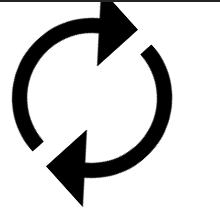

### 如何实现一个 loading 动画？

@keyframes

第一种：

```
<svg id="loading" class="loading" viewBox="0 0 32 32">
<path d="M27.802 5.197c-2.925-3.194-7.13-5.197-11.803-5.197-8.837 0-16 7.163-16 16h3c0-7.18 5.82-13 13-13 3.844 0 7.298 1.669 9.678 4.322l-4.678 4.678h11v-11l-4.198 4.197z"></path>
<path d="M29 16c0 7.18-5.82 13-13 13-3.844 0-7.298-1.669-9.678-4.322l4.678-4.678h-11v11l4.197-4.197c2.925 3.194 7.13 5.197 11.803 5.197 8.837 0 16-7.163 16-16h-3z"></path>
</svg>
```

```
.loading {
  display: inline-block;
  width: 5em;
  height: 5em;
  stroke-width: 0;
  stroke: currentColor;
  fill: currentColor;
  animation: rotate 2s linear infinite;
}

@keyframes rotate {
  from {
    transform: rotateZ(0deg);
  }
  to {
    transform: rotateZ(360deg);
  }
}
```
第二种：

```
<div id="ddr">
    <div class="ddr ddr1"></div>
    <div class="ddr ddr2"></div>
    <div class="ddr ddr3"></div>
    <div class="ddr ddr4"></div>
    <div class="ddr ddr5"></div>
</div>
```
```
#ddr{
    margin: 0 auto;
    width: 70px;
    height: 120px;
}
.ddr{
    width: 10px;
    height: 120px;
    float: left;
    margin: 2px;
    background-color: #00ff00;
    animation: loading 1s infinite ease-in-out;/*animation：动画名称 持续时间 动画速度曲线 延迟 执行多少次 是否正反方向轮流播放*/
}
.ddr2{
    animation-delay: -0.9s;/*定义开始执行的地方，负号表示直接从第900ms开始执行*/
}
.ddr3{
    animation-delay: -0.8s;
}
.ddr4{
    animation-delay: -0.7s;
}
.ddr5{
    animation-delay: -0.6s;
}
@keyframes loading {
    0%,40%,100%{ /*定义每帧的动作*/
        -webkit-transform: scaleY(0.5);
    }
    20%{
        -webkit-transform: scaleY(1);
    }
}
```

第三种：

```
<div id="circle"></div>
```
```
#circle{
    margin: 20px auto;
    width: 100px;
    height: 100px;
    border: 5px white solid;
    border-left-color: #ff5500;
    border-right-color:#0c80fe;
    border-radius: 100%;
    animation: loading1 1s infinite linear;
}
@keyframes loading1{
    from{transform: rotate(0deg)}to{transform: rotate(360deg)}
}
```

第四种：

```
 <div id="loading">
     <div id="loader" class="heart"></div>
 </div>
```
```
#loading{
    width: 100%;
    height: 100px;
}
#loader{
    position: relative;
    margin-left: calc(50% - 25px);
    width: 50px;
    height: 50px;
    animation: loader 1s ease-in-out alternate infinite;
}
.heart:before{
    position: absolute;
    left: 11px;
    content: "";
    width: 50px;
    height: 80px;
    transform: rotate(45deg);
    background-color: rgb(230, 6, 6);
    border-radius: 50px 50px 0 0;
}
.heart:after{
    position: absolute;
    right: 11px;
    content: "";
    width: 50px;
    height: 80px;
    background-color: rgb(230, 6, 6);
    transform: rotate(-45deg);
    border-radius: 50px 50px 0 0;
}
@keyframes loader {
    0%{
        transform: scale(0.2);
        opacity: 0.5;
    }
    100%{
        transform: scale(1);
        opacity: 1;
    }
}
```

其它：https://zhuanlan.zhihu.com/p/350607485

> transform 和@keyframes动画的区别：
> @keyframes动画是循环的，而transform 只执行一遍。
