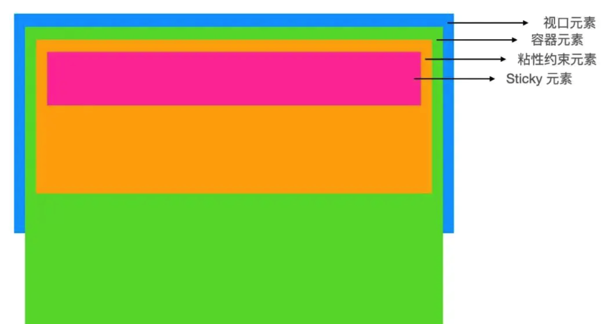

### 定义
position：sticky又称为粘性定位，是css3新增的。粘性定位的元素依赖于用户的滚动，在相对定位（relative）与固定定位（fixed）之间进行切换，基于位偏移的值进行偏移。

粘性定位可以被认为是相对定位和固定定位的混。
元素在跨越特定位偏移之前为相对定位，之后为固定定位。

特点：
1. 该元素并不脱离文档流，仍然保留元素原本在文档流中的位置。
2. 元素固定的相对偏移是相对于离它最近的具有滚动框的祖先元素，如果祖先元素都不可以滚动，那么是相对于viewport来计算元素的偏移量。
3. 当元素在容器中被滚动超过指定的偏移值时，元素在容器内固定在指定位置。亦即如果你设置了top:50px，那么在sticky元素到达距离相对定位的元素顶部50px的位置时固定，不再向上移动。
4. 元素定位表现为在跨越特定阈值前为相对定位，之后为固定定位。

### 原理
为便于理解粘性定位，这里引入四个元素：视口元素，容器元素，粘性约束元素 和 sticky 元素。它们的关系如下：

* 视口元素：显示内容的区域。会设置宽，高。一般会设置 overflow:hidden。
* 容器元素：离 sticky 元素最近的能滚动的祖先元素。
* 粘性约束元素：粘性定位的父元素。有时，也会出现粘性约束元素就是容器元素的情况。
* sticky 元素：设置了 position: sticky; 的元素。
 
    > 滚动时，sticky 元素设置的 left, right, top, bottom 的值相对的是容器元素。当粘性约束元素滚出视口时，sticky 元素也会滚出视口。

### 不生效的情况
1. 未指定 top, right, top 和 bottom 中的任何一个值
    * 此时，设置 position: sticky 相当于设置 position: relative。
    * 要生效，要指定 top, right, top 或 bottom 中的任何一个值。

2. 垂直滚动时，粘性约束元素高度小于等于 sticky 元素高度
   * 不生效的原因：当粘性约束元素滚出视口时，sticky 元素也会滚出视口。粘性约束元素比 sticky 元素还小，sticky 元素没有显示固定定位状态的机会。
   * 同样的，水平滚动时，粘性约束元素宽度小于等于 sticky 元素宽度时，也不会生效。

3. 粘性约束元素和容器元素之间存在 overflow: hidden 的元素

### position: sticky 适用于哪些场景？
**适用场景：** 常作用在导航和概览信息(标题，表头，操作栏，底部评论等)上。
这样，用户在浏览详细信息时，也能看到信息的概览和做一些操作，给用户带来便捷的使用体验。

参考文章： https://blog.csdn.net/JiangLittleBai/article/details/108653463