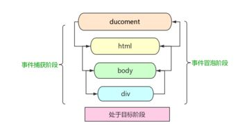

### 定义
把原本需要绑定在子元素的响应事件（click、keydown......）委托给父元素，让父元素担当事件监听的职务。又称为“事件委托”。

### 原理
DOM元素的事件冒泡。

### 优点
1. 可以大量节省内存占用，减少事件注册，比如在ul上代理所有li的click事件就非常棒。
2. 可以实现当新增子对象时无需再次对其绑定（动态绑定事件）。

### 实现
JavaScript原生实现事件委托，比如我们有这样的一个 HTML 片段：

```
<ul id="myLinks">
  <li id="goSomewhere">Go somewhere</li>
  <li id="doSomething">Do something</li>
  <li id="sayHi">Say hi</li>
</ul>
```

按照传统的做法，需要像下面这样为它们添加 3 个事 件处理程序。

```
    var item1 = document.getElementById("goSomewhere");
    var item2 = document.getElementById("doSomething");
    var item3 = document.getElementById("sayHi");
    item1.onclick = function() {
      location.href = "http://www.baidu.com";
    };
    item2.onclick = function() {
      document.title = "事件委托";
    };
    item3.onclick = function() {
      alert("hi");
    };
```

如果在一个复杂的 Web 应用程序中，对所有可单击的元素都采用这种方式，那么结果就会有数不 清的代码用于添加事件处理程序。此时，可以利用事件委托技术解决这个问题。使用事件委托，只需在 DOM 树中尽量最高的层次上添加一个事件处理程序，如下面的例子所示:

```
    var item1 = document.getElementById("goSomewhere");
    var item2 = document.getElementById("doSomething");
    var item3 = document.getElementById("sayHi");
    document.addEventListener("click", function (event) {
      var target = event.target;
      switch (target.id) {
        case "doSomething":
          document.title = "事件委托";
          break;
        case "goSomewhere":
          location.href = "http://www.baidu.com";
          break;
        case "sayHi": alert("hi");
          break;
      }
    })
```

### 注意事项
使用“事件委托”时，并不是说把事件委托给的元素越靠近顶层就越好。事件冒泡的过程也需要耗时，越靠近顶层，事件的”事件传播链”越长，也就越耗时。如果DOM嵌套结构很深，事件冒泡通过大量祖先元素会导致性能损失。

### 事件

事件像个水中的气泡一样一直往上冒，直到顶端。从DOM树形结构上理解，就是事件由叶子节点沿祖先节点一直向上传递直到根节点；从浏览器界面视图HTML元素排列层次上理解就是事件由具有从属关系的最确定的目标元素一直传递到最不确定的目标元素.冒泡技术.冒泡型事件的基本思想，事件按照从特定的事件目标开始到最不确定的事件目标.

一个事件触发后，会在子元素和父元素之间传播（propagation）。这种传播分成三个阶段：



如上图所示，事件传播分成三个阶段：
1. 捕获阶段：从window对象传导到目标节点（上层传到底层）称为“捕获阶段”（capture phase），捕获阶段不会响应任何事件；
2. 目标阶段：在目标节点上触发，称为“目标阶段”
3. 冒泡阶段：从目标节点传导回window对象（从底层传回上层），称为“冒泡阶段”（bubbling phase）。事件代理即是利用事件冒泡的机制把里层所需要响应的事件绑定到外层；

假设一个元素div，它有一个下级元素p。

```
<div>
　　<p>元素</p>
</div>
```

这两个元素都绑定了click事件，如果用户点击了p，它在div和p上都触发了click事件，那这两个事件处理程序哪个先执行呢？ 
* 如div先触发，这就叫做事件捕获。
* 如p先触发，这就叫做事件冒泡。
IE只支持事件冒泡，其他主流浏览器两种都支持。

程序员可以自己选择绑定事件时采用事件捕获还是事件冒泡，方法就是绑定事件时通过 -addEventListener- 函数，它有三个参数，第三个参数若是true，则表示采用事件捕获，若是false，则表示采用事件冒泡。

<b>阻止事件传播：stopPropagation()</b><br>
&emsp;&emsp;在捕获的过程中使用 stopPropagation() 后，后面的冒泡过程也不会发生了。

<b>阻止事件的默认行为</b><br>
例如click a标签后的跳转:
<br>&emsp;&emsp;在W3c中，使用preventDefault（）方法；
<br>&emsp;&emsp;在IE下设置window.event.returnValue = false;

> 事件流描述的是从页面中接受事件的顺序，但有意思的是，微软（IE）和网景（Netscape）开发团队居然提出了两个截然相反的事件流概念，IE的事件流是事件冒泡流(event bubbling)，而Netscape的事件流是事件捕获流(event capturing)。

### 事件冒泡
事件从事件目标(target)开始，往上冒泡直到页面的最上一级标签。

IE提出的事件流叫做事件冒泡，即事件开始时由最具体的元素接收，然后逐级向上传播到较为不具体的节点，看一下以下示例：

```
<!DOCTYPE html>
<html lang="en">
<head>
    <meta charset="UTF-8">
    <title>Title</title>
</head>
<body onclick="bodyClick()">
    <div onclick="divClick()">
        <button onclick="btn()">
            <p onclick="p()">点击冒泡</p>
        </button>
    </div>
    <script>
        function p(){
            console.log('p标签被点击')
        }
        function btn(){
            console.log("button被点击")
        }
        function divClick(event){
            console.log('div被点击');
        }
        function bodyClick(){
            console.log('body被点击')
        }
    </script>

</body>
</html>
```

如果点击P元素：它会从一个最具体的的元素接收，然后逐级向上传播， p=>button=>div=>body..........事件冒泡可以形象地比喻为把一颗石头投入水中，泡泡会一直从水底冒出水面。

### 事件捕获
事件从最上一级标签开始往下查找，直到捕获到事件目标(target)。

网景公司提出的事件流叫事件捕获流。事件捕获流的思想是不太具体的DOM节点应该更早接收到事件，而最具体的节点应该最后接收到事件。

```
<!DOCTYPE html>
<html lang="en">
<head>
    <meta charset="UTF-8">
    <title>Title</title>
</head>
<body>

    <div>
        <button>
            <p>点击捕获</p>
        </button>
    </div>
    <script>
        var oP=document.querySelector('p');
        var oB=document.querySelector('button');
        var oD=document.querySelector('div');
        var oBody=document.querySelector('body');

        oP.addEventListener('click',function(){
            console.log('p标签被点击')
        },true);

        oB.addEventListener('click',function(){
            console.log("button被点击")
        },true);

        oD.addEventListener('click', function(){
            console.log('div被点击')
        },true);

        oBody.addEventListener('click',function(){
            console.log('body被点击')
        },true);

    </script>

</body>
</html>
```

后台的打印结果：和冒泡流相反，从最不具体的元素接收到最具体的元素接收事件  body=>div=>button=>p 
