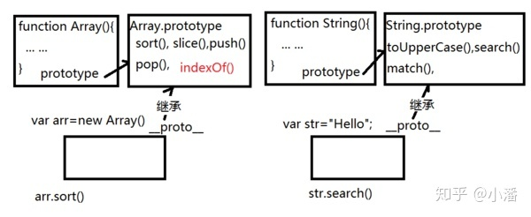
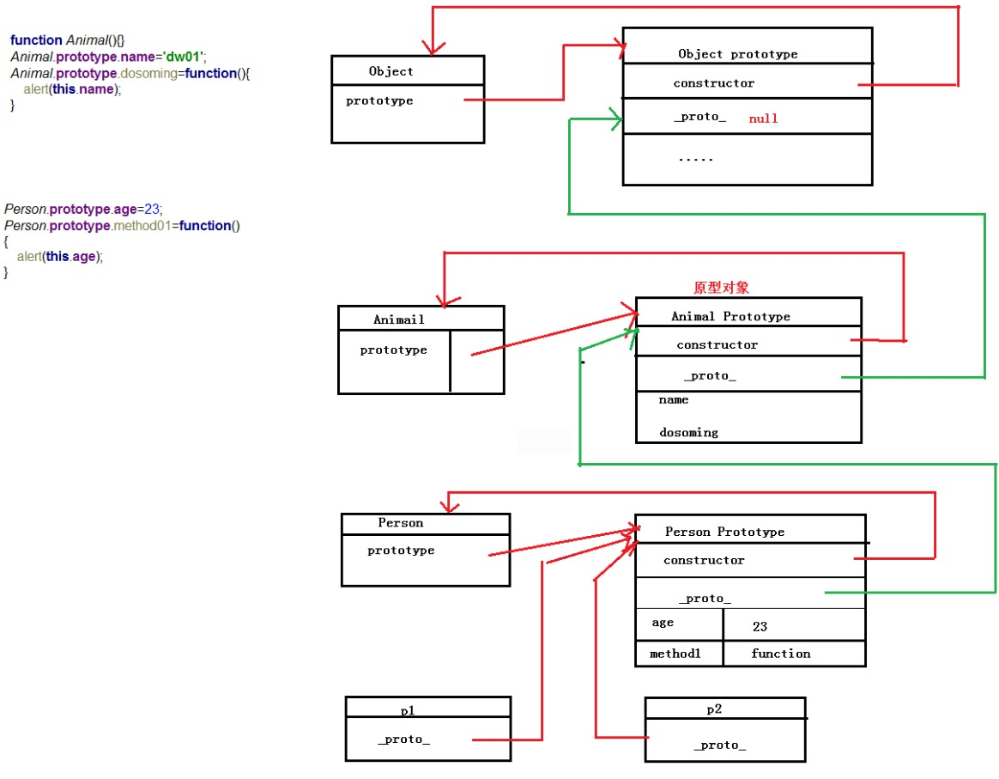

### 原型 prototype
JS中每个函数都存在有一个原型对象属性prototype。并且所有函数的默认原型都是Object的实例。

### 原型链

每个继承父函数的子函数的对象都包含一个内部属性_proto_。该属性包含一个指针，指向父函数的prototype。若父函数的原型对象的_proto_属性为再上一层函数。在此过程中就形成了原型链。

#### 特点
原型链实现了继承。



#### 图形解释



### 继承方法
#### 1. 原型链继承 

<b>核心：</b>将父类的实例作为子类的原型

```
function Animal() {}
Animal.prototype.say = function() {
    console.log('say hello');
}

function Cat(){}
Cat.prototype = new Animal();
Cat.prototype.name = 'cat..';

// Test Code
var cat = new Cat();
cat.say(); // say hello
console.log('cat name: ', cat.name); // cat name: cat..
```

<b>重点：</b>让新实例的原型等于父类的实例。

<b>特点：</b>实例可继承的属性有：实例的构造函数的属性，父类构造函数属性，父类原型的属性。（新实例不会继承父类实例的属性！）

<b>缺点：</b>

* 新实例无法向父类构造函数传参。
* 继承单一。
* 所有新实例都会共享父类实例的属性。（原型上的属性是共享的，一个实例修改了原型属性，另一个实例的原型属性也会被修改！）

#### 2. 构造继承
<b>核心：</b>使用父类的构造函数来增强子类实例，等于是复制父类的实例属性给子类，没有用到原型。

```
function Animal1() {
    this.say = function() {
        console.log('say 构造继承');
    }
}
function Cat1(name) {
    Animal1.call(this);
    this.name = name || 'Tom';
}

// Test Code
var cat1 = new Cat1();
console.log(cat1.name); // Tom
cat1.say(); // say 构造继承
console.log(cat1 instanceof Animal1); // false
console.log(cat1 instanceof Cat1); // true
```

由于call方法可以更改函数的作用环境，因此在子类中，对 Cat1 调用这个方法就是将子类中的变量在父类执行一遍，由于父类中是给this绑定属性的，因此子类自然就继承了父类的共有属性。

但是，这种类型的继承没有涉及原型prototype，所以父类的原型方法自然不会被子类继承，而要想被子类继承就必须把放在构造函数里，这样创建出来的每个实例都会单独拥有一份而不能共用，这样就违背了代码复用的原则。

<b>重点：</b>用.call()和.apply()将父类构造函数引入子类函数（在子类函数中做了父类函数的自执行（复制））

<b>特点：</b>

* 只继承了父类构造函数的属性，没有继承父类原型的属性。
* 解决了原型链继承缺点1、2、3。
* 可以继承多个构造函数属性（call多个）。
* 在子实例中可向父实例传参。

<b>缺点：</b>

* 只能继承父类构造函数的属性。
* 无法实现构造函数的复用。（每次用每次都要重新调用）
* 每个新实例都有父类构造函数的副本，臃肿。

#### 3. 实例继承
<b>核心：</b>为父类实例增加新特性，作为子类实例返回。

```
function Animal3() {
    this.say = function() {
        console.log('say 构造继承');
    }
}
function Cat3(name) {
    var instance = new Animal3();
    instance.name = name || 'Tom';
    return instance;
}

// Test Code
var cat3 = new Cat3();

console.log(cat3.name); // Tom
cat3.say(); // say 构造继承
console.log(cat3 instanceof Animal3); // true\
console.log(cat3 instanceof Cat3); // false
```

#### 4. 组合继承
是常用的继承，组合 原型链 继承和借用 构造函数 继承。
　　　　 
<b>重点：</b>结合了两种模式的优点，传参和复用。

<b>特点：</b>

* 可以继承父类原型上的属性，可以传参，可复用。
* 每个新实例引入的构造函数属性是私有的。

<b>缺点：</b>调用了两次父类构造函数（耗内存），子类的构造函数会代替原型上的那个父类构造函数。