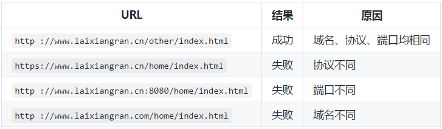
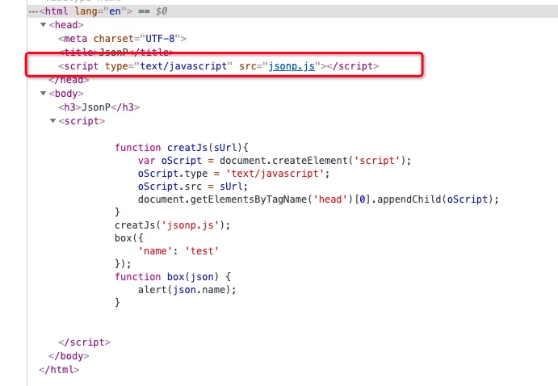
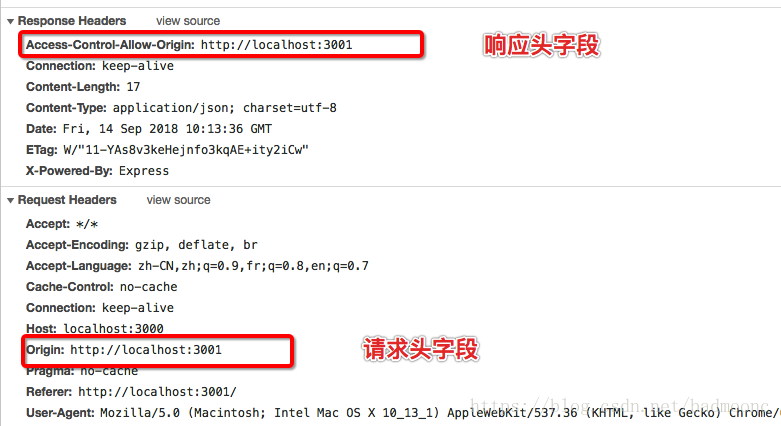
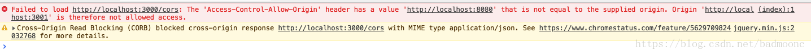
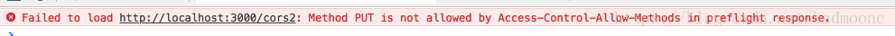
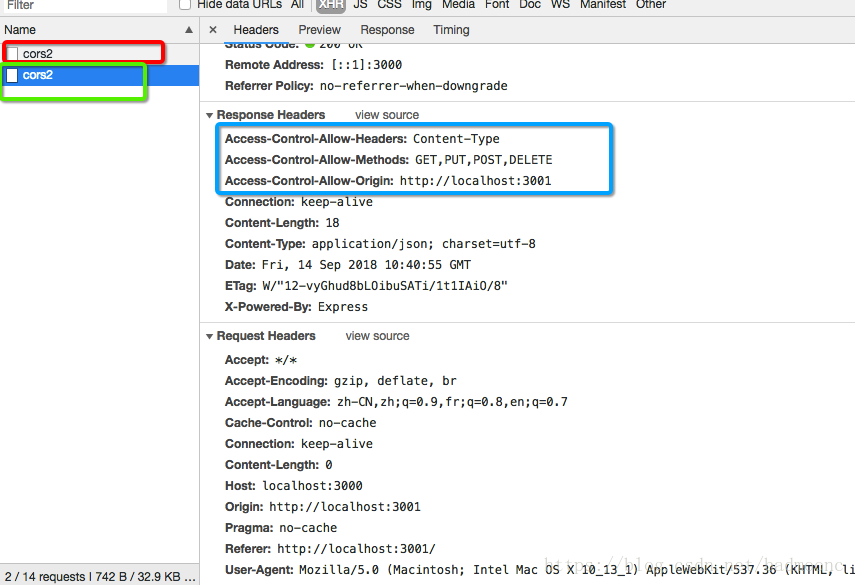

### 同源策略
同源策略（Same origin policy）是一种约定，它是浏览器最核心也最基本的安全功能，如果缺少了同源策略，则浏览器的正常功能可能都会受到影响。可以说 Web 是构建在同源策略基础之上的，浏览器只是针对同源策略的一种实现。

它的核心就在于它认为自任何站点装载的信赖内容是不安全的。当被浏览器半信半疑的脚本运行在沙箱时，它们应该只被允许访问来自同一站点的资源，而不是那些来自其它站点可能怀有恶意的资源。
###### 同源是指：域名、协议、端口相同
下表是相对于 http://www.laixiangran.cn/home/index.html 的同源检测结果：

###### 种类：
1. DOM 同源策略：禁止对不同源页面 DOM 进行操作。这里主要场景是 iframe 跨域的情况，不同域名的 iframe 是限制互相访问的。
2. XMLHttpRequest 同源策略：禁止使用 XHR 对象向不同源的服务器地址发起 HTTP 请求。

###### 为什么要有跨域限制？
因为存在浏览器同源策略，所以才会有跨域问题。那么浏览器是出于何种原因会有跨域的限制呢。其实不难想到，跨域限制主要的目的就是为了用户的上网安全。      

由于同源策略的限制，XmlHttpRequest只允许请求当前源（域名、协议、端口）的资源。简单来说，就是只相信自己人，不相信外人，只响应同域名发来的http请求，不相信其他域名发来的http请求。

好处是减少上当受骗的几率；缺点是不符合webapi的大趋势，api访问会受限。

###### 如果浏览器没有同源策略，会存在什么样的安全问题呢?
下面从 DOM 同源策略和 XMLHttpRequest 同源策略来举例说明：

    如果没有 DOM 同源策略，也就是说不同域的 iframe 之间可以相互访问，那么黑客可以这样进行攻击:
        1. 做一个假网站，里面用 iframe 嵌套一个银行网站 http://mybank.com。
        2. 把 iframe 宽高啥的调整到页面全部，这样用户进来除了域名，别的部分和银行的网站没有任何差别。
        3. 这时如果用户输入账号密码，我们的主网站可以跨域访问到 http://mybank.com 的 dom 节点，就可以拿到用户的账户密码了。

    如果 XMLHttpRequest 同源策略，那么黑客可以进行 CSRF（跨站请求伪造） 攻击：
        1. 用户登录了自己的银行页面 http://mybank.com，http://mybank.com 向用户的 cookie 中添加用户标识。
        2. 用户浏览了恶意页面 http://evil.com，执行了页面中的恶意 AJAX 请求代码。
        3. http://evil.com 向 http://mybank.com 发起 AJAX HTTP 请求，请求会默认把 http://mybank.com 对应 cookie 也同时发送过去。
        4. 银行页面从发送的 cookie 中提取用户标识，验证用户无误，response 中返回请求数据。此时数据就泄露了。
        5. 而且由于 Ajax 在后台执行，用户无法感知这一过程。

因此，有了浏览器同源策略，我们才能更安全的上网。

### 跨域
* 跨协议
* 跨域名：包括主域名和子域名。
* 跨端口号

不需要同源访问的操作：
```

<linked href>
<script>
```

如何解决跨域问题：
* JSONP
* CORS
* document.domain
* window.name
* postMessage
* 代理服务器ngnix

#### 1. jsonp
JSONP：json+padding（内填充），顾名思义，就是把JSON填充到一个盒子里.

<b>原理是：</b>
动态插入script标签，通过script标签引入一个js文件（利用img、script、link标签的src或href来实现），这个js文件载入成功后会执行我们在url参数中指定的函数，并且会把我们需要的json数据作为参数传入。兼容性好，简单易用，缺点：只支持get请求。
```
<script>
    function createJs(sUrl) {
        var oScript = document.createElement('script');
        oScript.type = 'text/javascript';
        oScript.src = sUrl;
        document.getElementsByTagName('head')[0].appendChild(oScript);
    }
    createJs('jsonp.js');
    box({
       'name': 'test'
    });
    function box(json){
        alert(json.name);
    }
</script>
```
运行结果：<br>


```
// 1. 定义一个 回调函数 handleResponse 用来接收返回的数据
function handleResponse(data) {
    console.log(data);
};

// 2. 动态创建一个 script 标签，并且告诉后端回调函数名叫 handleResponse
var body = document.getElementsByTagName('body')[0];
var script = document.gerElement('script');
script.src = 'http://www.laixiangran.cn/json?callback=handleResponse';
body.appendChild(script);

// 3. 通过 script.src 请求 `http://www.laixiangran.cn/json?callback=handleResponse`，
// 4. 后端能够识别这样的 URL 格式并处理该请求，然后返回 handleResponse({"name": "laixiangran"}) 给浏览器
// 5. 浏览器在接收到 handleResponse({"name": "laixiangran"}) 之后立即执行 ，也就是执行 handleResponse 方法，获得后端返回的数据，这样就完成一次跨域请求了。
```

优点:
* 使用简便，没有兼容性问题，目前最流行的一种跨域方法。

缺点:
* 只支持 GET 请求。
* 由于是从其它域中加载代码执行，因此如果其他域不安全，很可能会在响应中夹带一些恶意代码。
* 要确定 JSONP 请求是否失败并不容易。虽然 HTML5 给 script 标签新增了一个 onerror 事件处理程序，但是存在兼容性问题。

#### 2. CORS
CORS 全称"跨域资源共享"（Cross-origin resource sharing）;

CORS需要后端设置响应头cross-domain-allow字段来允许跨域，前端也要设置个withCredentials是否传递cookie。

服务器端对于CORS的支持，主要就是通过设置 Access-Control-Allow-Origin 来进行的。如果浏览器检测到相应的设置，就可以允许Ajax进行跨域的访问。

CORS需要浏览器和服务器同时支持，才可以实现跨域请求，目前几乎所有浏览器都支持CORS，IE则不能低于IE10。CORS的整个过程都由浏览器自动完成，前端无需做任何设置，跟平时发送ajax请求并无差异。so，实现CORS的关键在于服务器，只要服务器实现CORS接口，就可以实现跨域通信。
###### 请求类型：简单请求 和 非简单请求(需预检请求)
<b>1. 符合以下条件的，为简单请求。</b>

请求方式使用下列方法之一：
* GET
* HEAD
* POST
 
Content-Type 的值仅限于下列三者之一：
* text/plain
* multipart/form-data
* application/x-www-form-urlencoded

对于简单请求，浏览器会直接发送CORS请求，具体说来就是在header中加入origin请求头字段。同样，在响应头中，返回服务器设置的相关CORS头部字段，Access-Control-Allow-Origin字段为允许跨域请求的源。请求时浏览器在请求头的Origin中说明请求的源，服务器收到后发现允许该源跨请求，则会成功返回，具体如下：

<br>在这里，http://localhost:3001为我们当前发送请求的源，如果服务器发现请求在指定的源范围内，则会返回响应的请求结果， 否则会在控制台报错，如下图所示，在这里需要注意的是，尽管请求失败，但返回的状态码依然可能为200。所以在做处理时需要格外注意。<br>


<b>2. 非简单请求(预检请求)</b>

使用了下面任一 HTTP 方法：
* PUT
* DELETE
* CONNECT
* OPTIONS
* TRACE
* PATCH
 
Content-Type 的值不属于下列之一:
* application/x-www-form-urlencoded
* multipart/form-data
* text/plain

当发生符合非简单请求（预检请求）的条件时，浏览器会自动先发送一个options请求，如果发现服务器支持该请求，则会将真正的请求发送到后端，反之，如果浏览器发现服务端并不支持该请求，则会在控制台抛出错误，如下：


如果非简单请求（预检请求）发送成功，则会在头部多返回以下字段：
* Access-Control-Allow-Origin: http://localhost:3001  //该字段表明可供那个源跨域
* Access-Control-Allow-Methods: GET, POST, PUT        // 该字段表明服务端支持的请求方法
* Access-Control-Allow-Headers: X-Custom-Header       // 实际请求将携带的自定义请求首部字段

下图为一个预检请求实例：



红框标注的为预检请求发送的查询，服务端支持我们的请求后，将会发送我们真正的请求，图中绿框所示。可以看到，真正的请求响应头字段多处蓝框中所圈字段。这为服务器所支持cors请求类型和允许的自定义请求首部字段，以及支持跨域的源。

<b>实例代码,</b> 前端代码与发送普通请求没有差异，我们只需在服务端设置即可，以node为例：
```
var express = require('express');
var app = express();
var allowCrossDomain = function (req, res, next) {
  res.header('Access-Control-Allow-Origin', 'http://localhost:3001');
  res.header('Access-Control-Allow-Methods', 'GET,PUT,POST,DELETE');
  res.header('Access-Control-Allow-Headers', 'Content-Type');
  next();
}
app.use(allowCrossDomain);
```
接下来，http://localhost:3001 下的GET,PUT,POST,DELETE请求，自定义首部字段为Content-Type的非简单请求则会被正常访问，当然，你也可以将Access-control-Allow-Methods和Access-Control-Allow-Headers这两个配置删掉，删掉之后，将仅支持简单请求进行跨域。

###### CORS字段介绍：

（1）Access-Control-Allow-Methods

该字段必需，它的值是逗号分隔的一个字符串，表明服务器支持的所有跨域请求的方法。注意，返回的是所有支持的方法，而不单是浏览器请求的那个方法。这是为了避免多次"预检"请求。

（2）Access-Control-Allow-Headers

如果浏览器请求包括Access-Control-Request-Headers字段，则Access-Control-Allow-Headers字段是必需的。它也是一个逗号分隔的字符串，表明服务器支持的所有头信息字段，不限于浏览器在"预检"中请求的字段。

（3）Access-Control-Allow-Origin

该字段与简单请求时的含义相同。

（4）Access-Control-Max-Age

该字段可选，用来指定本次预检请求的有效期，单位为秒。上面结果中，有效期是20天（1728000秒），即允许缓存该条回应1728000秒（即20天），在此期间，不用发出另一条预检请求。

总的来说，使用CORS简单请求，非常容易，对于前端来说无需做任何配置，与发送普通ajax请求无异。唯一需要注意的是，需要携带cookie信息时，需要将withCredentials设置为true即可。CORS的配置，完全在后端设置，配置起来也比较容易，目前对于大部分浏览器兼容性也比较好。CORS优势也比较明显，可以实现任何类型的请求，相较于JSONP跨域只能使用get请求来说，也更加的便于我们使用

#### 3. document.domain
通过修改document.domain来跨子域

将子域和主域的document.domain设为同一个主域。

前提条件：这两个域名必须属于同一个基础域名!而且所用的协议，端口都要一致，否则无法利用 document.domain 进行跨域。

对于主域名相同，而子域名不同的情况，可以使用 document.domain 来跨域。这种方式非常适用于 iframe 跨域的情况。

这个时候，document.domain 就可以派上用场了，我们只要把 http://www.laixiangran.cn/a.html 和 http://laixiangran.cn/b.html 这两个页面的 document.domain 都设成相同的域名就可以了。但要注意的是，document.domain 的设置是有限制的，我们只能把 document.domain 设置成自身或更高一级的父域，且主域必须相同。

例如：a.b.laixiangran.cn 中某个文档的 document.domain 可以设成 a.b.laixiangran.cn、b.laixiangran.cn 、laixiangran.cn 中的任意一个，但是不可以设成 c.a.b.laixiangran.cn ，因为这是当前域的子域，也不可以设成 baidu.com，因为主域已经不相同了。

例如，在页面 http://www.laixiangran.cn/a.html 中设置document.domain：

```
<iframe src="http://laixiangran.cn/b.html" id="myIframe" onload="test()">
<script>
    document.domain = 'laixiangran.cn'; // 设置成主域
    function test() {
        console.log(document.getElementById('myIframe').contentWindow);
    }
</script>
```
在页面 http://laixiangran.cn/b.html 中也设置 document.domain，而且这也是必须的，虽然这个文档的 domain 就是 laixiangran.cn，但是还是必须显式地设置 document.domain 的值：
```
<script>
    document.domain = 'laixiangran.cn'; // document.domain 设置成与主页面相同
</script>
```
这样，http://www.laixiangran.cn/a.html 就可以通过 js 访问到 http://laixiangran.cn/b.html 中的各种属性和对象了。

#### 4. window.name
window对象有个name属性，该属性有个特征：即在一个窗口(window)的生命周期内,窗口载入的所有的页面都是共享一个window.name的，每个页面对window.name都有读写的权限，window.name是持久存在一个窗口载入过的所有页面中的，并不会因新页面的载入而进行重置。

window.name的方法既不复杂，也能兼容到几乎所有的浏览器，这真是极好的跨域方式。

通过下面的例子介绍如何通过 window.name 来跨域获取数据的。页面 http://www.laixiangran.cn/a.html 的代码：

```
<iframe src="http://laixiangran.cn/b.html" id="myIframe" onload="test()" style="display: none;">
<script>
    // 2. iframe载入 "http://laixiangran.cn/b.html 页面后会执行该函数
    function test() {
        var iframe = document.getElementById('myIframe');
        
        // 重置 iframe 的 onload 事件程序，
        // 此时经过后面代码重置 src 之后，
        // http://www.laixiangran.cn/a.html 页面与该 iframe 在同一个源了，可以相互访问了
        iframe.onload = function() {
            var data = iframe.contentWindow.name; // 4. 获取 iframe 里的 window.name
            console.log(data); // hello world!
        };
        
        // 3. 重置一个与 http://www.laixiangran.cn/a.html 页面同源的页面
        iframe.src = 'http://www.laixiangran.cn/c.html';
    }
</script>
```

页面 http://laixiangran.cn/b.html 的代码：
```
<script type="text/javascript">
    // 1. 给当前的 window.name 设置一个 http://www.laixiangran.cn/a.html 页面想要得到的数据值 
    window.name = "hello world!";
</script>
```

#### 5. postMessage（html5）
postMessage可以在浏览器端的网页之间进行通信。
* 网页与该网页打开的新网页
* 网页和内嵌的iframe
    
window.postMessage(message，targetOrigin) 方法是 HTML5 新引进的特性，可以使用它来向其它的 window 对象发送消息，无论这个 window 对象是属于同源或不同源。这个应该就是以后解决 dom 跨域通用方法了。

调用 postMessage 方法的 window 对象是指要接收消息的那一个 window 对象，该方法的第一个参数 message 为要发送的消息，类型只能为字符串；第二个参数 targetOrigin 用来限定接收消息的那个 window 对象所在的域，如果不想限定域，可以使用通配符 *。

需要接收消息的 window 对象，可是通过监听自身的 message 事件来获取传过来的消息，消息内容储存在该事件对象的 data 属性中。
页面 http://www.laixiangran.cn/a.html 的代码：

```
<iframe src="http://laixiangran.cn/b.html" id="myIframe" onload="test()" style="display: none;">
<script>
    // 1. iframe载入 "http://laixiangran.cn/b.html 页面后会执行该函数
    function test() {
        // 2. 获取 http://laixiangran.cn/b.html 页面的 window 对象，
        // 然后通过 postMessage 向 http://laixiangran.cn/b.html 页面发送消息
        var iframe = document.getElementById('myIframe');
        var win = iframe.contentWindow;
        win.postMessage('我是来自 http://www.laixiangran.cn/a.html 页面的消息', '*');
    }
</script>
```

页面 http://laixiangran.cn/b.html 的代码：

```
<script type="text/javascript">
    // 注册 message 事件用来接收消息
    window.onmessage = function(e) {
        e = e || event; // 获取事件对象
        console.log(e.data); // 通过 data 属性得到发送来的消息
    }
</script>
```

#### 6. 代理服务器
使用中间代理服务器转发来进行处理跨域问题。两种方式，一种是node的本地代理服务器，用于开发环境中
* node本地代理服务器。访问到本地服务器，然后由本地服务器来进行访问远程服务器。
* nginx反向代理。

#### 7. iframe
hashChange：改变iframe的url上的hash，然后iframe通过监听hashchange。
document.domain：只能用于二级域名相同的情况下

图像 Ping 跨域

由于 img 标签不受浏览器同源策略的影响，允许跨域引用资源。因此可以通过 img 标签的 src 属性进行跨域，这也就是图像 Ping 跨域的基本原理。
直接通过下面的例子来说明图像 Ping 实现跨域的流程：
var img = new Image();

// 通过 onload 及 onerror 事件可以知道响应是什么时候接收到的，但是不能获取响应文本
img.onload = img.onerror = function() {
    console.log("Done!");
}

// 请求数据通过查询字符串形式发送
img.src = 'http://www.laixiangran.cn/test?name=laixiangran';

location.hash 跨域

location.hash 方式跨域，是子框架具有修改父框架 src 的 hash 值，通过这个属性进行传递数据，且更改 hash 值，页面不会刷新。但是传递的数据的字节数是有限的。
页面 http://www.laixiangran.cn/a.html 的代码：
<iframe src="http://laixiangran.cn/b.html" id="myIframe" onload="test()" style="display: none;">
<script>
    // 2. iframe载入 "http://laixiangran.cn/b.html 页面后会执行该函数
    function test() {
        // 3. 获取通过 http://laixiangran.cn/b.html 页面设置 hash 值
        var data = window.location.hash;
        console.log(data);
    }
</script>

页面 http://laixiangran.cn/b.html 的代码：
<script type="text/javascript">
    // 1. 设置父页面的 hash 值
    parent.location.hash = "world";
</script>