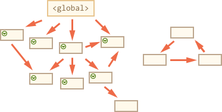

### 方法：标记清除法、引用计数法
### 标记-清除
##### 工作流程
    1、垃圾回收器获取根并“标记”(记住)它们。
    2、然后它访问并“标记”所有来自它们的引用。
    3、然后它访问标记的对象并标记它们的引用。所有被访问的对象都被记住，以便以后不再访问同一个对象两次。
    4、以此类推，直到有未访问的引用(可以从根访问)为止。
    5、除标记的对象外，所有对象都被删除。

### 引用计数
这个算法把“对象是否不再需要”简化定义为“对象是否可以获得”。
##### 工作原理
跟踪记录每个值被引用的次数。

##### 工作流程：
    1、声明了一个变量并将一个引用类型的值赋值给这个变量，这个引用类型值的引用次数就是1。
    2、同一个值又被赋值给另一个变量，这个引用类型值的引用次数加1.
    3、当包含这个引用类型值的变量又被赋值成另一个值了，那么这个引用类型值的引用次数减1.
    4、当引用次数变成0时，说明没办法访问这个值了。
    5、当垃圾收集器下一次运行时，它就会释放引用次数是0的值所占的内存。

垃圾回收属于JavaScript 中的内存管理，是自动执行的，而且是不可见的。我们创建基本类型、对象、函数……所有这些都需要内存。

垃圾回收方面，栈内存变量（基本类型）基本上用完就回收了，而推内存（object类型）中的变量因为存在很多不确定的引用，只有当所有调用的变量全部销毁之后才能回收。

##### 可达性
“可达性” 值就是那些以某种方式可访问或可用的值。

有一组基本的固有可达值，这些值称为根，如：全局变量；当前嵌套调用链上的其他函数的变量和参数；当前作用域的局部变量和参数等。

如果引用或引用链可以从根访问任何其他值，则认为该值是可访问的，也就是可达的。

JavaScript 引擎中有一个后台进程称为垃圾回收器（垃圾收集器会按照固定的时间间隔周期性的执行），它监视所有对象，并删除那些不可访问的对象。
 
一个简单的 例子：
```
let user = {
  name: "John";
};
```


这里箭头表示一个对象引用。全局变量“user”引用对象 {name:“John”} ,如果 user 的值被覆盖，则引用丢失:
```
user = null;
```


现在这个对象变成不可达的状态，因为没有办法访问它，没有对它的引用。垃圾回收器将丢弃这个对象并释放内存。

另一个例子：
```
let user = {
  name: "John";
};

let admin = user;
```


现在如果我们做同样的事情:
```
user = null;
```
{name:“John”}仍然可以通过全局变量admin访问，所以他没有被回收。 
 

##### 垃圾回收算法：标记-清除
如下图：


我们可以清楚地看到右边有一个“不可到达的块”。现在让我们看看“标记并清除”垃圾回收器如何处理它。

第一步标记根


然后标记他们的引用


 
以及子孙代的引用


现在进程中不能访问的对象被认为是不可访问的，将被删除


 
##### 垃圾回收算法：引用计数
但是引用计数在循环引用的时候就会释放不掉内存。

循环引用就是对象A中包含另一个指向对象B的指针，B中也包含一个指向A的引用。

在IE 中有一部分对象并不是原生 JS 对象。例如，其内存泄露 DOM 和 BOM 中的对象就是使用 C++ 以 COM 对象的形式实现的，而 COM（(Component Object Model)） 对象的垃圾回收机制采用的就是引用计数策略。

因此，即使IE的js引擎采用标记清除策略来实现，但 JS 访问的COM对象依然是基于引用计数策略的。

因此，在IE中就会有循环引用的问题，用引用计数的垃圾回收算法就清除不掉这部分内存，在IE中就容易内存泄漏。

解决：手工断开js对象和DOM之间的链接。赋值为null。IE9把DOM和BOM转换成真正的JS对象了，所以避免了这个问题