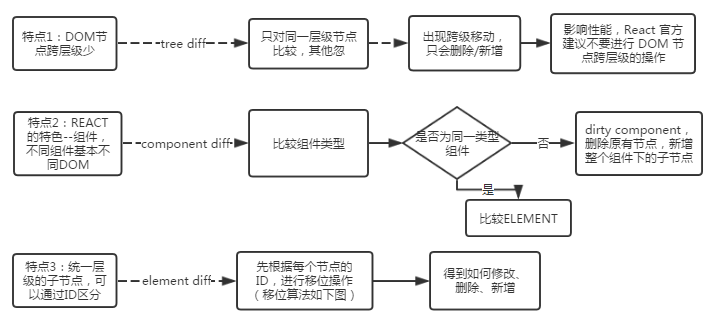
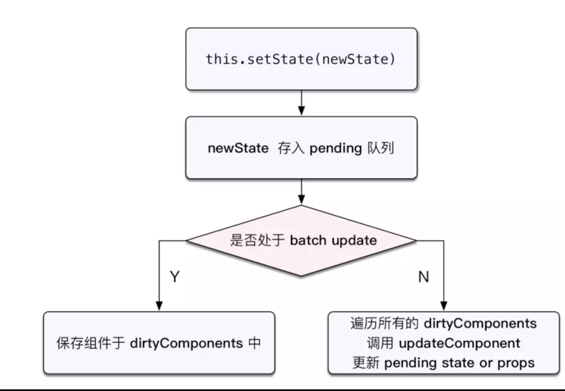

### react做了什么
* Virtual Dom模型
* 生命周期管理
* setState机制
* diff算法
* React patch、事件系统
* react的 Virtual Dom模型

virtual dom 实际上是对实际Dom的一个抽象，是一个js对象。react所有的表层操作实际上是在操作virtual dom。

经过diff算法会计算出virtual dom的差异，然后将这些差异进行实际的dom操作更新页面。

### React组件的渲染流程
* 使用React.createElement或JSX编写React组件，实际上所有的JSX 代码最后都会转换成React.createElement(...) ，Babel帮助我们完成了这个转换的过程。
* createElement函数对key和ref等特殊的props进行处理，并获取defaultProps对默认props进行赋值，并且对传入的孩子节点进行处理，最终构造成一个ReactElement对象（所谓的虚拟DOM）。
* ReactDOM.render将生成好的虚拟DOM渲染到指定容器上，其中采用了批处理、事务等机制并且对特定浏览器进行了性能优化，最终转换为真实DOM。

### 虚拟DOM的组成
即ReactElementelement对象，我们的组件最终会被渲染成下面的结构：
* type：元素的类型，可以是原生html类型（字符串），或者自定义组件（函数或class）
* key：组件的唯一标识，用于Diff算法，下面会详细介绍
* ref：用于访问原生dom节点
* props：传入组件的props，chidren是props中的一个属性，它存储了当前组件的孩子节点，可以是数组（多个孩子节点）或对象（只有一个孩子节点）
* owner：当前正在构建的Component所属的Component
* self：（非生产环境）指定当前位于哪个组件实例
* _source：（非生产环境）指定调试代码来自的文件(fileName)和代码行数(lineNumber)


### react生命周期有哪些
#### 组件载入阶段：
* ```componentWillMount```: 组件即将被装载、渲染到页面上，只调用1次
* ```componentDidMount```: 组件真正在被装载之后，这里可以拿到真实DOM执行操作，只调用1次

#### 运行中状态：
* ```componentWillReceiveProps(nextProps)```: 组件将要接收到新属性的时候调用，在这时setState不会触发额外的render,因为此时已经有一次来自父组件引发的render了。
* ```shouldComponentUpdate```: 组件接受到新属性或者新状态的时候（返回 false，接收数据后不更新，阻止 render ，后面的函数不会继续执行）
* ```componentWillUpdate```: 组件即将更新不能修改属性和状态
* ```componentDidUpdate```: 组件已经更新

#### 销毁阶段：
```componentWillUnmount```: 组件即将销毁，这时候可以销毁绑定的事件监听或者定时器什么的。

有些好像把render也算进生命周期了：
render: 组件在这里生成虚拟的 DOM 节点

### react在哪个生命周期做优化
```shouldComponentUpdate```，这个方法用来判断是否需要调用 render 方法重绘 dom。

因为 dom 的描绘非常消耗性能，如果我们能在这个方法中能够写出更优化的 dom diff 算法，可以极大的提高性能。

### react 的 diff 算法
1. 把树形结构按照层级分解，只比较同级元素。
2. 通过给列表结构的每个单元添加的唯一 key值进行区分同层次的子节点的比较。
3. React 只会匹配相同 class 的 component（这里面的 class 指的是组件的名字）
4. 合并操作，调用 component 的 setState 方法的时候, React 将其标记为 dirty。到每一个事件循环结束, React 检查所有标记 dirty 的 component 重新绘制。
5. 选择性渲染。开发人员可以重写 shouldComponentUpdate 提高 diff 的性能。



### react虚拟DOM实现原理，以及虚拟DOM提高性能的原因
#### 实现原理：
1. 用 js对象结构表示 DOM 树的结构；然后用这个树构建一个真正的 DOM 树，插到文档当中。
2. 当状态变更的时候，重新构造一棵新的对象树。然后对比新旧虚拟DOM树，记录两棵树差异。
3. 把 2 所记录的差异应用到步骤 1 所构建的真正的 DOM 树上，视图就更新了。

#### 原因：
虚拟 dom 相当于在 js 和真实 dom 中间加了一个缓存，利用 dom diff 算法减少了对真实DOM的操作次数，从而提高性能。

### react怎么从虚拟dom中拿出真实dom
Refs 是 React 提供给我们的安全访问 DOM 元素或者某个组件实例的句柄。

我们可以为元素添加 ref 属性然后在回调函数中接受该元素在 DOM 树中的句柄，该值会作为回调函数的第一个参数返回。或者ref可以传字符串。

例如：```<input ref=((input)=>{return this.name=input}) />```， this.name.value取值。<br>
或者 ```<input ref="name" />```，this.refs.name取值

### React中的props和state的用法
* state 是一种```数据结构```，用于组件挂载时所需数据的默认值。state 可能会随着时间的推移而发生突变，但多数时候是作为用户事件行为的结果。
* Props则是```组件的配置```。props 由父组件传递给子组件，并且就子组件而言，props 是不可变的(immutable)。

### react组件之间如何通信
父子：父传子：props； 子传父：子调用父组件中的函数并传参；
兄弟：利用redux实现。
所有关系都通用的方法：利用PubSub.js订阅

### setState 的原理及用法
#### 原理：当调用setState时，它并不会立即改变，而是会把要修改的状态放入一个任务队列，等到事件循环结束时，再合并指更新。
因此，setState有 异步，合并更新更新两个特性。这里应该需要了解下Batch Update 。



#### 使用：
1. 最常见的用法就是传入一个对象。
```
    this.setState({
        isLoading:false
    })
```

2. 还可以接收一个函数
```
    this.setState((prevState,props)=>{
        // 要做的事件
        return {isLoading:false};
    })
```

3. 因为setState是异步的，所以它还可以接收第二个参数，一个回调函数
```
    this.setState({count:2},()=>{
        isLoading:this.state.count===2 ? true : false
    })
```

### setState为什么是异步的
1. 保证内部的一致性
> 因为props是要等到父组件渲染过后才能拿到，也就是不能同步更新，state出于统一性设成异步更新。
2. 性能优化
> 举例说你正在一个聊天窗口输入，如果来了一条新消息又要render,那就会阻塞你的当前操作，导致延迟什么的。
3. 支持state在幕后渲染
> 异步可以使state在幕后更新，而不影响你当前旧的页面的交互，提升用户体验。

另外：```setstate在原生事件，setTimeout,setInterval,promise等异步操作中，state会同步更新```。

### react的优势以及特点
#### 优势：
1. ```实现对虚拟DOM的操作，使得它速度快，提高了Web性能。```
2. ```组件化，模块化。react里每一个模块都是一个组件，组件化开发，可维护性高。```
3. ```单向数据流，比较有序，有便于管理，它随着React视图库的开发而被Facebook概念化。```
4. ```跨浏览器兼容：虚拟DOM帮助我们解决了跨浏览器问题，它为我们提供了标准化的API，甚至在IE8中都是没问题的。```

#### 不足：
1. ```react中只是MVC模式的View部分，要依赖引入很多其他模块开发。```
2. ```当父组件进行重新渲染操作时，即使子组件的props或state没有做出任何改变，也会同样进行重新渲染。```

#### 特点：　
1. ```声明式设计：React采用声明范式，可以轻松描述应用。```
2. ```高效：React通过对DOM的模拟，最大限度地减少与DOM的交互。```
3. ```灵活：React可以与已知的库或框架很好地配合。```

### React如何性能优化
讲一些项目中用到的小的点：
1. ```充分利用shouldComponentUpdate函数，不过这需要你的组件尽量最小化，如果当前组件数据过于复杂，其实是很难优化的。```
2. ```给你的DOM遍历上加上唯一的key,注意尽量不要用index,因为如果你新DOM中删了某一个节点，它会重新排列index，那跟原来同层级一比就都会完全不一样，而重新渲染了，所以最好使用id值什么的作key值。```

3. ```能用const声明的就用const。```
4. ```DOM里少用箭头函数，当然其实要传参时也还是得用。再者，函数bind尽量写在constructor，避免每次render重新bind。```
5. ```减少对真实DOM的操作。```
6. ```如果是用webpack搭建环境的话，当一个包过大加载过慢时，可分打成多个包来优化。```

react-perf性能查看工具，可自行了解下：react-perf

### react 与 vue的对比
#### 相同点：
1. ```都用虚拟DOM实现快速渲染```
2. ```我觉得父子，兄弟通信这些都挺像的，也都有自己的状态管理器：react=>redux, vue=>vuex```
3. ```都是轻量级框架```
4. ```现在vue也在渐渐吸收react中的一些语法，比如JSX语法，类式声明写法等```
#### 不同点：
1. ```React属于单向数据流——MVC模式，vue则属于双向——MVVM模式。```
2. ```react兼容性比vue好，vue不兼容IE8.```
3. ```react采用JSX语法，vue采用的则是html模板语法。```
4. ```vue的css可以有组件的私有作用域，react则没有。```
5. ```react比vue好的另一点是，它是团队维护，而vue属于个人，一般来说，大型项目更倾向于react，小型则用vue，当然这也不是绝对。```

### Redux的实现流程
用户页面行为触发一个Action，然后，Store 自动调用 Reducer，并且传入两个参数：当前 State 和收到的 Action。Reducer 会返回新的 State 。每当state更新之后，view会根据state触发重新渲染。

### react-redux的实现原理
Redux作为一个通用模块，主要还是用来处理应用中state的变更，通过react-redux做连接，可以在React+Redux的项目中将两者结合的更好。<br>
react-redux是一个轻量级的封装库，它主要通过两个核心方法实现：

    Provider：从最外部封装了整个应用，并向connect模块传递store。
    Connect： 
        1. 包装原组件，将state和action通过props的方式传入到原组件内部。
        2. 监听store tree变化，使其包装的原组件可以响应state变化

### redux中间件的理解，以及用过哪些中间件
理解：中间件就是要对redux的store.dispatch方法做一些改造，以实现其他的功能。

我用过redux-thunk，就拿它举例。

    背景：Redux 的基本做法，是用户发出 Action，Reducer 函数立刻算出新的 State，View 重新渲染，但这是做同步。

    而如果有异步请求时，那就不能知道什么时候获取的数据有存进store里面，因此此时需要在请求成功时返回一个标识或状态，并在此时再触发action给reducer传值。因此，为了解决异步的问题，就引入了中间件的概念。

作用： redux-thunk 帮助你统一了异步和同步 action 的调用方式，把异步过程放在 action 级别解决，对 component 调用没有影响。

    引入使用可参照：理解redux和redux的中间件redux-thunk的认识

### redux-thunk VS redux-saga对比 异步处理方案中间件
redux-thunk
* 缺点：
  1. 一个异步请求的action代码过于复杂，且异步操作太分散，相对比saga只要调用一个call方法就显得简单多了。
  2. action形式不统一，如果不一样的异步操作，就要写多个了。
* 优点：学习成本低

redux-saga:
* 优点：
  1. 集中处理了所有的异步操作，异步接口部分一目了然(有提供自己的方法)
  2. action是普通对象，这跟redux同步的action一模一样({type:XXX})
  3. 通过Effect，方便异步接口的测试
  4. 通过worker和watcher可以实现非阻塞异步调用，并且同时可以实现非阻塞调用下的事件监听
  5. 异步操作的流程是可以控制的，可以随时取消相应的异步操作。
* 缺点：学习成本高。

### redux 和 vuex 的区别
#### 相同点：
1. ```数据驱动视图，提供响应式的视图组件```
2. ```都有virtual DOM， 组件化开发，通过props参数进行父子组件数据的传递，都实现webComponents规范```
3. ```都支持服务端渲染  ```
4. ```都有native解决方案，reactnative（facebook团队） vs weex（阿里团队）```
#### 不同点：
1. ```vuex是一个针对VUE优化的状态管理系统，而redux仅是一个常规的状态管理系统（Redux）与React框架的结合版本。```
2. ```开发模式：React本身，是严格的view层，MVC模式；Vue则是MVVM模式的一种方式实现```
3. ```数据绑定：Vue借鉴了angular，采取双向数据绑定的方式；React，则采取单向数据流的方式```
4. ```数据更新：Vue采取依赖追踪，默认是优化状态：按需更新；```
   ```React在则有两种选择：```
   1. ```手动添加shouldComponentUpdate，来避免冗余的vdom，re-render的情况```
   2. ```Components 尽可能都用 pureRenderMixin，然后采用 redux 结构 + Immutable.js```
5. ```社区：react相比来讲还是要大于vue，毕竟背后支撑团队不同。```
   ```facebook vs 个人！当然目前vue的增长速度是高于react的增速，不知道未来的发展趋势是如何。```

```总之：期待构建一个大型应用程序——选择React，期待应用尽可能的小和快——选择Vue```

### react-router的实现原理
#### 原理：
实现URL与UI界面的同步。其中在react-router中，URL对应Location对象，
而UI是由react components来决定的，这样就转变成location与components之间的同步问题。

#### 优点：
1. ```风格: 与React融为一体,专为react量身打造，编码风格与react保持一致，例如路由的配置可以通过component来实现```
2. ```简单: 不需要手工维护路由state，使代码变得简单```
3. ```强大: 强大的路由管理机制，体现在如下方面```
4. ```路由配置: 可以通过组件、配置对象来进行路由的配置```
5. ```路由切换: 可以通过<Link> Redirect进行路由的切换```
6. ```路由加载: 可以同步记载，也可以异步加载，这样就可以实现按需加载```
7. ```使用方式: 不仅可以在浏览器端的使用，而且可以在服务器端的使用```

#### 缺点：
API不太稳定，在升级版本的时候需要进行代码变动。

### react router3到4有什么改变
1. V4不再使用V3里的{props.children}(代表所有路由-个人理解)，而V4丢给 DOM 的是我们的应用程序本身.
2. V4还同时支持同时渲染多个路由，1和2都可参照下面代码，当访问 /user 时，两个组件都会被渲染。(V3可实现但过程复杂)

```
  <div className="primary-layout">
    <header>
      Our React Router 4 App
      <Route path="/user" component={UsersMenu} />
    </header>
    <main>
      <Route path="/" exact component={HomePage} />
      <Route path="/user" component={UsersPage} />
    </main>
  </div>;
```

3. 获取路由的路径匹配，可以使用props.match.path获取，match上还有match.params,match.url等属性。
注：url是浏览器的url的一部分，path是给router写的路径
4. 多了一个限制未登录的用户访问某些路由功能，可以在应用程序顶端中设置一个主入口，区别登录和未登录UI展示界面。

### react高阶组件
#### 定义：
js里的高阶函数的定义是接收一个函数作为参数，并返回一个函数。redux的connect就是一个高阶函数。<br>
那react高阶组件就是指接收一个react组件作为入参，并返回一个新react组件的组件。

#### 好处：
它不用关心组件从哪来，也就是不用自己去引入很多个组件了。

##### 一个简单的高阶组件：(写法不是唯一)
```
    export default function withHeader(WrappedComponent){
        return class HOC extends component{
            return (
                <div className="wrap">
                    <div>这是一段普通的文字</div>
                    <WrappedComponent {...this.props} />
                </div>
            )
        }
    }
```
直接引入：import withHeader from 'withHeader'