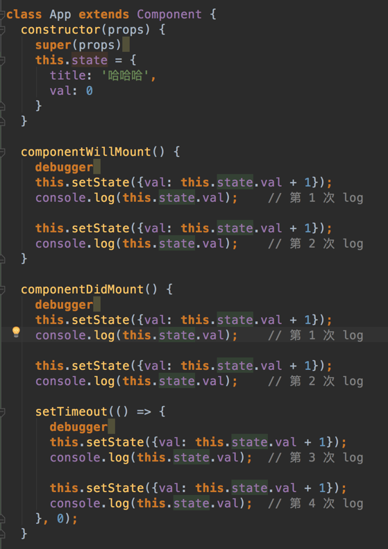

### setState基本特点
#### 1. setState是同步执行的

```setState```是<b>```同步```</b>执行的，但是```state```并```不一定会同步更新```

#### 2. setState在React生命周期和合成事件中批量覆盖执行

在React的```生命周期钩子```和```合成事件```中，```多次```执行setState，会批量执行。

具体表现为，多次同步执行的setState，会进行```合并```，类似于Object.assign，相同的key，后面的会覆盖前面的。

当遇到多个setState调用时候，会提取单次传递setState的对象，把他们合并在一起形成一个新的单一对象，并用这个单一的对象去做setState的事情，就像Object.assign的对象合并，后一个key值会覆盖前面的key值。

```
const a = {name : 'kong', age : '17'}
const b = {name : 'fang', sex : 'men'}
Object.assign({}, a, b);
//{name : 'fang', age : '17', sex : 'men'}
name被后面的覆盖了，但是age和sex都起作用了
```
例如：
```
class Hello extends React.Component {
    constructor(){
      super();
      this.state = {
        name: 'aa'
    }
  }
  componentWillMount(){
      this.setState({
        name: 'aa' + 1
    });
    console.log(this.state.name); //aa
    this.setState({
        name: 'aa' + 1
    });
    console.log(this.state.name); //aa
  }
  render() {
    return <div>
      <div>Hello {this.props.name}</div>
      <div>Hello {this.state.name}</div>
    </div>;
  }
}

ReactDOM.render(
  <Hello name="World" />,
  document.getElementById('container')
);
```

componentWillMount中两个log均为初始状态aa，而render中的state.name则为aa2。<br>
componentWillMount中的setState均执行了，但是state的更新是延迟的，所以log出的state均为aa。<br>
而render中的state.name则在state更新之后，而且只有第二次的aa1起了作用。

#### 3. setState在原生事件，setTimeout，setInterval，Promise等异步操作中，state会同步更新

异步操作中setState，即使在React的钩子或合成事件中，state都不会批量更新，而是会同步更新，多次连续操作setState，每次都会re-render，state会同步更新

### setState的形式
* ```setState(object,[callback])``` //对象式，object为nextState
* ```setState(function,[callback])``` //函数式，function为```(prevState,props) => stateChange```

```[callback]```则为state更新之后的回调，此时state已经完成更新，可以取到更新后的state。<br>
```[callback]```是在setState之后，更准确来说是当正式执行batchUpdate队列的state更新完成后就会执行，不是在re-rendered之后

使用两种形式的setState，state的更新都是异步的，但是多次连续使用函数式的setState，
React本身会进行一个递归传递调用，将上一次函数执行后的state传给下一个函数，因此每次执行
setState后能读取到更新后的state值。

如果对象式和函数式的setState混合使用，则对象式的会覆盖前面无论函数式还是对象式的任何setState，
但是不会影响后面的setState。

例如：
```
function increment(state,props){
    return {count: state.count + 1};
}

function incrementMultiple(){
    this.setState(increment);
    this.setState(increment);
    this.setState({count: this.state.count + 1});
    this.setState(increment);
}
```

上面三个函数式的setState中间插入一个对象式的setState，则最后的结果是2，而不是4，
因为对象式的setState将前面的任何形式的setState覆盖了，但是后面的setState依然起作用

### setState的基本过程

setState的调用会引起React的更新生命周期的4个函数执行。
1. ```shouldComponentUpdate```
2. ```componentWillUpdate```
3. ```render```
4. ```componentDidUpdate```

当shouldComponentUpdate执行时，返回true，进行下一步，this.state没有被更新
返回false，停止，更新this.state

当componentWillUpdate被调用时，this.state也没有被更新；直到render被调用时候，this.state才被更新。

总之，直到下一次```render函数调用(或者下一次shouldComponentUpdate返回false时)```才能得到更新后的this.state
因此获取更新后的状态可以有3种方法：

#### 1. setState函数式

#### 2. setState在setTimeout，Promise等异步中执行

```
setStatePromise(updator) {
    return new Promise(((resolve, reject) => {
        this.setState(updator, resolve);
    }));
}

componentWillMount() {
    this.setStatePromise(({ num }) => ({
        num: num + 1,
    })).then(() => {
        console.log(this.state.num);
    });
}
```

或者
```
function setStateAsync(nextState){  
  return new Promise(resolve => {
    this.setState(nextState, resolve);
  });
}

async func() {  
  ...
  await this.setStateAsync({count: this.state.count + 1});
  await this.setStateAsync({count: this.state.count + 1});
}
```

#### 3. setState callback
```
setState({
    index: 1
}}, function(){
    console.log(this.state.index);
})
```

#### 4. componentDidUpdate
```
componentDidUpdate(){
    console.log(this.state.index);
}
```

### setState批量更新的过程

在React的```生命周期```和```合成事件执行前后```都有相应的钩子，分别是```pre钩子```和```post钩子```，pre钩子会调用batchedUpdate方法将isBatchingUpdates变量置为true，开启批量更新，而post钩子会将isBatchingUpdates置为false

如下图所示：


isBatchingUpdates变量置为true，则会走批量更新分支，setState的更新会被存入队列中，待同步代码执行完后，再执行队列中的state更新。

而在原生事件和异步操作中，不会执行pre钩子，或者生命周期的中的异步操作之前执行了pre钩子，但是pos钩子也在异步操作之前执行完了，isBatchingUpdates必定为false，也就不会进行批量更新。

### setState的缺点

#### 1. setState有可能循环调用

调用setState之后，shouldComponentUpdate、componentWillUpdate、render、componentDidUpdate 等生命周期函数会依次被调用（如果shouldComponentUpdate没有返回 false的话），如果我们在render、componentWillUpdate或componentDidUpdate中调用了setState方法，那么可能会造成循环调用，最终导致浏览器内存占满后崩溃

#### 2、setState可能会引发不必要的渲染
可能造成不必要渲染的因素如下：
1. 新 state 和之前的一样。这种情况可以通过 shouldComponentUpdate 解决。
2. state 中的某些属性和视图没有关系（譬如事件、timer ID等），这些属性改变不影响视图的显示。

#### 3、setState并不总能有效地管理组件中的所有状态

因为组件中的某些属性是和视图没有关系的，当组件变得复杂的时候可能会出现各种各样的状态需要管理，这时候用setState管理所有状态是不可取的。state中本应该只保存与渲染有关的状态，而与渲染无关的状态尽量不放在state中管理，可以直接保存为组件实例的属性，这样在属性改变的时候，不会触发渲染，避免浪费

### setState和replaceState的区别

setState是修改其中的部分状态，相当于Object.assign，只是覆盖，不会减少原来的状态
replaceState是完全替换原来的状态，相当于赋值，将原来的state替换为另一个对象，如果新状态属性减少，那么state中就没有这个状态了

### 一个实例分析


上图的执行结果为 0 0 1 1 3 4