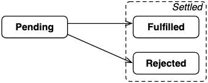

#### 观察者模式
我们先来看一个最简单的Promise使用：
```
const p1 = new Promise((resolve, reject) => {
    setTimeout(() => {
        resolve('result')
    },
    1000);
})
p1.then(res => console.log(res), err => console.log(err))
```
观察这个例子，我们分析Promise的调用流程：
* Promise的构造方法接收一个executor()，在new Promise()时就立刻执行这个executor回调
* executor()内部的异步任务被放入宏/微任务队列，等待执行
* then()被执行，收集成功/失败回调，放入成功/失败队列
* executor()的异步任务被执行，触发resolve/reject，从成功/失败队列中取出回调依次执行

其实熟悉设计模式的同学，很容易就能意识到这是个观察者模式，这种收集依赖 -> 触发通知 -> 取出依赖执行 的方式，被广泛运用于观察者模式的实现，在Promise里，执行顺序是then收集依赖 -> 异步触发resolve -> resolve执行依赖。

##### 依此，我们可以勾勒出Promise的大致形状：
```
class MyPromise {
  // 构造方法接收一个回调
  constructor(executor) {
    this._resolveQueue = []    // then收集的执行成功的回调队列
    this._rejectQueue = []     // then收集的执行失败的回调队列
    // 由于resolve/reject是在executor内部被调用, 因此需要使用箭头函数固定this指向, 否则找不到this._resolveQueue
    let _resolve = (val) => {
      // 从成功队列里取出回调依次执行
      while(this._resolveQueue.length) {
        const callback = this._resolveQueue.shift()
        callback(val)
      }
    }
    // 实现同resolve
    let _reject = (val) => {
      while(this._rejectQueue.length) {
        const callback = this._rejectQueue.shift()
        callback(val)
      }
    }
    // new Promise()时立即执行executor,并传入resolve和reject
    executor(_resolve, _reject)
  }
  // then方法,接收一个成功的回调和一个失败的回调，并push进对应队列
  then(resolveFn, rejectFn) {
    this._resolveQueue.push(resolveFn)
    this._rejectQueue.push(rejectFn)
  }
}
```

写完代码我们可以测试一下:
```
const p1 = new MyPromise((resolve, reject) => {
  setTimeout(() => {
    resolve('result')
  }, 1000);
})
p1.then(res => console.log(res))
//一秒后输出result复制代码
```

#### Promise A+规范
核心规则：
1. Promise本质是一个状态机，且状态只能为以下三种：Pending（等待态）、Fulfilled（执行态）、Rejected（拒绝态），状态的变更是单向的，只能从Pending -> Fulfilled 或 Pending -> Rejected，状态变更不可逆
2. then方法接收两个可选参数，分别对应状态改变时触发的回调。then方法返回一个promise。then 方法可以被同一个 promise 调用多次。

#### 特点：
1. 对象的状态不受外界影响 （3种状态）
* Pending状态（进行中）
* Fulfilled状态（已成功）
* Rejected状态（已失败）

2. 一旦状态改变就不会再变 （两种状态改变：成功或失败）
* Pending -> Fulfilled
* Pending -> Rejected



#### 组合
又称部分-整体模式，将对象整合成树形结构以表示“部分整体”的层次结构。组合模式使得用户对单个对象和组合对象的使用具有一致性，它基于两种函数：
* 基元函数(简短:基元)创建原子块。
* 组合函数（简称：组合）将原子和/或复合件组合在一起以形成复合件。

对于 JS 的 Promises 来说
* 基元函数包括:Promise.resolve()、Promise.reject()
* 组合函数：Promise.all(), Promise.race(), Promise.allSettled()

#### 创建Promise实例
```
var promise = new Promise(function(resolve, reject){
    // ... some code
    
    if (/* 异步操作成功 */) {
        resolve(value);
    } else {
        reject(error);
    }
})
```
Promise构造函数接受一个函数作为参数，该函数的两个参数分别是resolve和reject。它们是两个函数，由JavaScript引擎提供，不用自己部署。

resolve作用是将Promise对象状态由“未完成”变为“成功”，也就是Pending -> Fulfilled，在异步操作成功时调用，并将异步操作的结果作为参数传递出去；

而reject函数则是将Promise对象状态由“未完成”变为“失败”，也就是Pending -> Rejected，在异步操作失败时调用，并将异步操作的结果作为参数传递出去。

#### Promise.resolve()
Promise.resolve(value)方法返回一个以给定值解析后的Promise 对象。

如果该值为promise，返回这个promise；如果这个值是thenable（即带有"then" 方法)），返回的promise会“跟随”这个thenable的对象，采用它的最终状态；否则返回的promise将以此值完成。此函数将类promise对象的多层嵌套展平。
```
//静态的resolve方法
static resolve(value) {
  if(value instanceof MyPromise) return value // 根据规范, 如果参数是Promise实例, 直接return这个实例
  return new MyPromise(resolve => resolve(value))
}
```

#### Promise.reject()
Promise.reject()方法返回一个带有拒绝原因的Promise对象。
```
//静态的reject方法
static reject(reason) {
  return new MyPromise((resolve, reject) => reject(reason))
}
```

#### .all()
  用于将多个 Promise 实例，包装成一个新的 Promise 实例有时需要将现有对象转为 Promise 对象，Promise.resolve方法就起到这个作用。

##### 返回情况：

1. 完成（Fulfillment）：

如果传入的可迭代对象为空，Promise.all 会同步地返回一个已完成（resolved）状态的promise。

如果所有传入的 promise 都变为完成状态，或者传入的可迭代对象内没有 promise，Promise.all 返回的 promise 异步地变为完成。

在任何情况下，Promise.all 返回的 promise 的完成状态的结果都是一个数组，它包含所有的传入迭代参数对象的值（也包括非 promise 值）。

2. 失败/拒绝（Rejection）：

如果传入的 promise 中有一个失败（rejected），Promise.all 异步地将失败的那个结果给失败状态的回调函数，而不管其它 promise 是否完成。

如：
```
const promises = [
  Promise.resolve('a'),
  Promise.resolve('b'),
  Promise.reject('ERROR'),
];
Promise.all(promises)
  .catch((err) => assert.equal(
    err, 'ERROR'
  ));
```

##### Promise.all()的手动实现
```
function all(iterable) {
  return new Promise((resolve, reject) => {
    let index = 0;
    for (const promise of iterable) {
      // Capture the current value of `index`
      const currentIndex = index;
      promise.then(
        (value) => {
          if (anErrorOccurred) return;
          result[currentIndex] = value;
          elementCount++;
          if (elementCount === result.length) {
            resolve(result);
          }
        },
        (err) => {
          if (anErrorOccurred) return;
          anErrorOccurred = true;
          reject(err);
        });
      index++;
    }
    if (index === 0) {
      resolve([]);
      return;
    }
    let elementCount = 0;
    let anErrorOccurred = false;
    const result = new Array(index);
  });
}
```

#### .race()
返回一个 promise，一旦迭代器中的某个promise解决或拒绝，返回的 promise就会解决或拒绝。

```
const promises = [
    new Promise((resolve, reject)) => setTimeout(() => resolve('result'), 100), // (A)
    new Promise((resolve, reject)) => setTimeout(() => reject('ERROR'), 200), // (B)
];

Promise.race(promises).then((result) => assert.equal(result, 'result')); // (c)
// 在第 A 行，Promise 是完成状态 ，所以 第 C 行会执行（尽管第 B 行被拒绝）。
```
##### Promise.race()的手动实现
```
function race(iterable) {
  return new Promise((resolve, reject) => {
    for (const promise of iterable) {
      promise.then(
        (value) => {
          if (settlementOccurred) return;
          settlementOccurred = true;
          resolve(value);
        },
        (err) => {
          if (settlementOccurred) return;
          settlementOccurred = true;
          reject(err);
        });
    }
    let settlementOccurred = false;
  });
}
```

#### .finally()
  用于指定不管 Promise 对象最后状态如何，都会执行的操作。它与done方法的最大区别在于，它接受一个普通的回调函数作为参数，该函数不管怎样都必须执行。finally方法里面的操作，应该是与状态无关的，不依赖于 Promise 的执行结果。

```
//finally方法
finally(callback) {
  return this.then(
    value => MyPromise.resolve(callback()).then(() => value),             // MyPromise.resolve执行回调,并在then中return结果传递给后面的Promise
    reason => MyPromise.resolve(callback()).then(() => { throw reason })  // reject同理
  )
}
```

#### .then()
是定义在原型对象Promise.prototype上的。Promise实例生成后，可用then方法分别指定两种状态回调参数。then 方法可以接受两个回调函数作为参数：
* Promise对象状态改为Resolved时调用 （必选）
* Promise对象状态改为Rejected时调用 （可选）

##### 基本用法示例
```
function sleep(ms) {
    return new Promise(function(resolve, reject) {
        setTimeout(resolve, ms);
    })
}
sleep(500).then( ()=> console.log("finished"));
```
  这段代码定义了一个函数sleep，调用后，等待了指定参数(500)毫秒后执行then中的函数。值得注意的是，Promise新建后就会立即执行。

##### 如何实现then的链式调用
1. 显然.then()需要返回一个Promise，这样才能找到then方法，所以我们会把then方法的返回值包装成Promise。
2. .then()的回调需要顺序执行，以上面这段代码为例，虽然中间return了一个Promise，但执行顺序仍要保证是1->2->3。我们要等待当前Promise状态变更后，再执行下一个then收集的回调，这就要求我们对then的返回值分类讨论

```
then(resolveFn, rejectFn) {
  //return一个新的promise
  return new MyPromise((resolve, reject) => {
    //把resolveFn重新包装一下,再push进resolve执行队列,这是为了能够获取回调的返回值进行分类讨论
    const fulfilledFn = value => {
      try {
        //执行第一个(当前的)Promise的成功回调,并获取返回值
        let x = resolveFn(value)
        //分类讨论返回值,如果是Promise,那么等待Promise状态变更,否则直接resolve
        x instanceof MyPromise ? x.then(resolve, reject) : resolve(x)
      } catch (error) {
        reject(error)
      }
    }
    //把后续then收集的依赖都push进当前Promise的成功回调队列中(_rejectQueue), 这是为了保证顺序调用
    this._resolveQueue.push(fulfilledFn)
    //reject同理
    const rejectedFn  = error => {
      try {
        let x = rejectFn(error)
        x instanceof MyPromise ? x.then(resolve, reject) : resolve(x)
      } catch (error) {
        reject(error)
      }
    }
    this._rejectQueue.push(rejectedFn)
  })
}
```

测试：
```
const p1 = new MyPromise((resolve, reject) => {
  setTimeout(() => {
    resolve(1)
  }, 500);
})
p1
  .then(res => {
    console.log(res)
    return 2
  })
  .then(res => {
    console.log(res)
    return 3
  })
  .then(res => {
    console.log(res)
  })
//输出 1 2 3
```
##### 值穿透 & 状态已变更的情况
我们已经初步完成了链式调用，但是对于 then() 方法，我们还要两个细节需要处理一下
1. 值穿透：根据规范，如果 then() 接收的参数不是function，那么我们应该忽略它。如果没有忽略，当then()回调不为function时将会抛出异常，导致链式调用中断
2. 处理状态为resolve/reject的情况：其实我们上边 then() 的写法是对应状态为padding的情况，但是有些时候，resolve/reject 在 then() 之前就被执行（比如Promise.resolve().then()），如果这个时候还把then()回调push进resolve/reject的执行队列里，那么回调将不会被执行，

因此对于状态已经变为fulfilled或rejected的情况，我们直接执行then回调：

```
// then方法,接收一个成功的回调和一个失败的回调
  then(resolveFn, rejectFn) {
    // 根据规范，如果then的参数不是function，则我们需要忽略它, 让链式调用继续往下执行
    typeof resolveFn !== 'function' ? resolveFn = value => value : null
    typeof rejectFn !== 'function' ? rejectFn = reason => {
      throw new Error(reason instanceof Error? reason.message:reason);
    } : null
  
    // return一个新的promise
    return new MyPromise((resolve, reject) => {
      // 把resolveFn重新包装一下,再push进resolve执行队列,这是为了能够获取回调的返回值进行分类讨论
      const fulfilledFn = value => {
        try {
          // 执行第一个(当前的)Promise的成功回调,并获取返回值
          let x = resolveFn(value)
          // 分类讨论返回值,如果是Promise,那么等待Promise状态变更,否则直接resolve
          x instanceof MyPromise ? x.then(resolve, reject) : resolve(x)
        } catch (error) {
          reject(error)
        }
      }
  
      // reject同理
      const rejectedFn  = error => {
        try {
          let x = rejectFn(error)
          x instanceof MyPromise ? x.then(resolve, reject) : resolve(x)
        } catch (error) {
          reject(error)
        }
      }
  
      switch (this._status) {
        // 当状态为pending时,把then回调push进resolve/reject执行队列,等待执行
        case PENDING:
          this._resolveQueue.push(fulfilledFn)
          this._rejectQueue.push(rejectedFn)
          break;
        // 当状态已经变为resolve/reject时,直接执行then回调
        case FULFILLED:
          fulfilledFn(this._value)    // this._value是上一个then回调return的值(见完整版代码)
          break;
        case REJECTED:
          rejectedFn(this._value)
          break;
      }
    })
  }
```

##### 兼容同步任务
完成了then的链式调用以后，我们再处理一个前边的细节，然后放出完整代码。上文我们说过，Promise的执行顺序是new Promise -> then()收集回调 -> resolve/reject执行回调，这一顺序是建立在executor是异步任务的前提上的，如果executor是一个同步任务，那么顺序就会变成new Promise -> resolve/reject执行回调 -> then()收集回调，resolve的执行跑到then之前去了，为了兼容这种情况，我们给resolve/reject执行回调的操作包一个setTimeout，让它异步执行。

这里插一句，有关这个setTimeout，其实还有一番学问。虽然规范没有要求回调应该被放进宏任务队列还是微任务队列，但其实Promise的默认实现是放进了微任务队列，我们的实现（包括大多数Promise手动实现和polyfill的转化）都是使用setTimeout放入了宏任务队列（当然我们也可以用MutationObserver模拟微任务）

```
//Promise/A+规定的三种状态const PENDING = 'pending'const FULFILLED = 'fulfilled'const REJECTED = 'rejected'
class MyPromise {
  // 构造方法接收一个回调
  constructor(executor) {
    this._status = PENDING     // Promise状态
    this._value = undefined    // 储存then回调return的值
    this._resolveQueue = []    // 成功队列, resolve时触发
    this._rejectQueue = []     // 失败队列, reject时触发
    // 由于resolve/reject是在executor内部被调用, 因此需要使用箭头函数固定this指向, 否则找不到this._resolveQueue
    let _resolve = (val) => {
      //把resolve执行回调的操作封装成一个函数,放进setTimeout里,以兼容executor是同步代码的情况
      const run = () => {
        if(this._status !== PENDING) return   // 对应规范中的"状态只能由pending到fulfilled或rejected"
        this._status = FULFILLED              // 变更状态
        this._value = val                     // 储存当前value
        // 这里之所以使用一个队列来储存回调,是为了实现规范要求的 "then 方法可以被同一个 promise 调用多次"
        // 如果使用一个变量而非队列来储存回调,那么即使多次p1.then()也只会执行一次回调
        while(this._resolveQueue.length) {    
          const callback = this._resolveQueue.shift()
          callback(val)
        }
      }
      setTimeout(run)
    }
    // 实现同resolve
    let _reject = (val) => {
      const run = () => {
        if(this._status !== PENDING) return   // 对应规范中的"状态只能由pending到fulfilled或rejected"
        this._status = REJECTED               // 变更状态
        this._value = val                     // 储存当前value
        while(this._rejectQueue.length) {
          const callback = this._rejectQueue.shift()
          callback(val)
        }
      }
      setTimeout(run)
    }
    // new Promise()时立即执行executor,并传入resolve和reject
    executor(_resolve, _reject)
  }
  // then方法,接收一个成功的回调和一个失败的回调
  then(resolveFn, rejectFn) {
    // 根据规范，如果then的参数不是function，则我们需要忽略它, 让链式调用继续往下执行
    typeof resolveFn !== 'function' ? resolveFn = value => value : null
    typeof rejectFn !== 'function' ? rejectFn = reason => {
      throw new Error(reason instanceof Error? reason.message:reason);
    } : null
  
    // return一个新的promise
    return new MyPromise((resolve, reject) => {
      // 把resolveFn重新包装一下,再push进resolve执行队列,这是为了能够获取回调的返回值进行分类讨论
      const fulfilledFn = value => {
        try {
          // 执行第一个(当前的)Promise的成功回调,并获取返回值
          let x = resolveFn(value)
          // 分类讨论返回值,如果是Promise,那么等待Promise状态变更,否则直接resolve
          x instanceof MyPromise ? x.then(resolve, reject) : resolve(x)
        } catch (error) {
          reject(error)
        }
      }
  
      // reject同理
      const rejectedFn  = error => {
        try {
          let x = rejectFn(error)
          x instanceof MyPromise ? x.then(resolve, reject) : resolve(x)
        } catch (error) {
          reject(error)
        }
      }
  
      switch (this._status) {
        // 当状态为pending时,把then回调push进resolve/reject执行队列,等待执行
        case PENDING:
          this._resolveQueue.push(fulfilledFn)
          this._rejectQueue.push(rejectedFn)
          break;
        // 当状态已经变为resolve/reject时,直接执行then回调
        case FULFILLED:
          fulfilledFn(this._value)    // this._value是上一个then回调return的值(见完整版代码)
          break;
        case REJECTED:
          rejectedFn(this._value)
          break;
      }
    })
  }
}
```

然后我们可以测试一下这个Promise：

```
const p1 = new MyPromise((resolve, reject) => {
  resolve(1)          //同步executor测试
})
p1
  .then(res => {
    console.log(res)
    return 2          //链式调用测试
  })
  .then()             //值穿透测试
  .then(res => {
    console.log(res)
    return new MyPromise((resolve, reject) => {
      resolve(3)      //返回Promise测试
    })
  })
  .then(res => {
    console.log(res)
    throw new Error('reject测试')   //reject测试
  })
  .then(() => {}, err => {
    console.log(err)
  })
// 输出 // 1 // 2 // 3 // Error: reject测试
```

##### Promise.prototype.catch()
  返回一个Promise，并且处理拒绝的情况。它的行为与调用Promise.prototype.then(undefined, onRejected) 相同。
  
  另外，then方法指定的回调函数，如果运行中抛出错误，也会被catch方法捕获。
  抛异常，throw new Error(‘test)可以发现reject方法的作用，等同于抛出错误。如果没有使用catch方法指定错误处理的回调函数，Promise 对象抛出的错误不会传递到外层代码，即不会有任何反应Promise 内部的错误不会影响到 Promise 外部的代码。

```
//catch方法其实就是执行一下then的第二个回调
catch(rejectFn) {
  return this.then(undefined, rejectFn)
}
```

##### 执行顺序
```
let promise = new Promise(function(resolve, reject){
    console.log("1");
    resolve();
});
setTimeout(()=>console.log("2"), 0);
promise.then(() => console.log("3"));
console.log("4");

// 1
// 4
// 3
// 2
```
  2与3先输出Promise的then，而后输出定时器任务。原因则是Promise属于JavaScript引擎内部任务，而setTimeout则是浏览器API，而引擎内部任务优先级高于浏览器API任务

#### Promise优缺点
优点 |	缺点
-|-
解决回调  |	无法监测进行状态  （当处于pending状态时，无法得知目前进展到哪一个阶段（刚刚开始还是即将完成））
链式调用  |	新建立即执行且无法取消
减少嵌套  |	（不设置回调时，）内部错误无法抛出

#### Promise的实现

```
class MyPromise {
  // 构造方法接收一个回调
  constructor(executor) {
    this._status = PENDING     // Promise状态
    this._resolveQueue = []    // 成功队列, resolve时触发
    this._rejectQueue = []     // 失败队列, reject时触发
    // 由于resolve/reject是在executor内部被调用, 因此需要使用箭头函数固定this指向, 否则找不到this._resolveQueue
    let _resolve = (val) => {
      if(this._status !== PENDING) return   // 对应规范中的"状态只能由pending到fulfilled或rejected"
      this._status = FULFILLED              // 变更状态
      // 这里之所以使用一个队列来储存回调,是为了实现规范要求的 "then 方法可以被同一个 promise 调用多次"
      // 如果使用一个变量而非队列来储存回调,那么即使多次p1.then()也只会执行一次回调
      while(this._resolveQueue.length) {    
        const callback = this._resolveQueue.shift()
        callback(val)
      }
    }
    // 实现同resolve
    let _reject = (val) => {
      if(this._status !== PENDING) return   // 对应规范中的"状态只能由pending到fulfilled或rejected"
      this._status = REJECTED               // 变更状态
      while(this._rejectQueue.length) {
        const callback = this._rejectQueue.shift()
        callback(val)
      }
    }
    // new Promise()时立即执行executor,并传入resolve和reject
    executor(_resolve, _reject)
  }
  // then方法,接收一个成功的回调和一个失败的回调
  then(resolveFn, rejectFn) {
    this._resolveQueue.push(resolveFn)
    this._rejectQueue.push(rejectFn)
  }
}
```

```
//Promise/A+规定的三种状态const PENDING = 'pending'const FULFILLED = 'fulfilled'const REJECTED = 'rejected'
class MyPromise {
  // 构造方法接收一个回调
  constructor(executor) {
    this._status = PENDING     // Promise状态
    this._value = undefined    // 储存then回调return的值
    this._resolveQueue = []    // 成功队列, resolve时触发
    this._rejectQueue = []     // 失败队列, reject时触发
    // 由于resolve/reject是在executor内部被调用, 因此需要使用箭头函数固定this指向, 否则找不到this._resolveQueue
    let _resolve = (val) => {
      //把resolve执行回调的操作封装成一个函数,放进setTimeout里,以兼容executor是同步代码的情况
      const run = () => {
        if(this._status !== PENDING) return   // 对应规范中的"状态只能由pending到fulfilled或rejected"
        this._status = FULFILLED              // 变更状态
        this._value = val                     // 储存当前value
        // 这里之所以使用一个队列来储存回调,是为了实现规范要求的 "then 方法可以被同一个 promise 调用多次"
        // 如果使用一个变量而非队列来储存回调,那么即使多次p1.then()也只会执行一次回调
        while(this._resolveQueue.length) {    
          const callback = this._resolveQueue.shift()
          callback(val)
        }
      }
      setTimeout(run)
    }
    // 实现同resolve
    let _reject = (val) => {
      const run = () => {
        if(this._status !== PENDING) return   // 对应规范中的"状态只能由pending到fulfilled或rejected"
        this._status = REJECTED               // 变更状态
        this._value = val                     // 储存当前value
        while(this._rejectQueue.length) {
          const callback = this._rejectQueue.shift()
          callback(val)
        }
      }
      setTimeout(run)
    }
    // new Promise()时立即执行executor,并传入resolve和reject
    executor(_resolve, _reject)
  }
  // then方法,接收一个成功的回调和一个失败的回调
  then(resolveFn, rejectFn) {
    // 根据规范，如果then的参数不是function，则我们需要忽略它, 让链式调用继续往下执行
    typeof resolveFn !== 'function' ? resolveFn = value => value : null
    typeof rejectFn !== 'function' ? rejectFn = reason => {
      throw new Error(reason instanceof Error? reason.message:reason);
    } : null
  
    // return一个新的promise
    return new MyPromise((resolve, reject) => {
      // 把resolveFn重新包装一下,再push进resolve执行队列,这是为了能够获取回调的返回值进行分类讨论
      const fulfilledFn = value => {
        try {
          // 执行第一个(当前的)Promise的成功回调,并获取返回值
          let x = resolveFn(value)
          // 分类讨论返回值,如果是Promise,那么等待Promise状态变更,否则直接resolve
          x instanceof MyPromise ? x.then(resolve, reject) : resolve(x)
        } catch (error) {
          reject(error)
        }
      }
  
      // reject同理
      const rejectedFn  = error => {
        try {
          let x = rejectFn(error)
          x instanceof MyPromise ? x.then(resolve, reject) : resolve(x)
        } catch (error) {
          reject(error)
        }
      }
  
      switch (this._status) {
        // 当状态为pending时,把then回调push进resolve/reject执行队列,等待执行
        case PENDING:
          this._resolveQueue.push(fulfilledFn)
          this._rejectQueue.push(rejectedFn)
          break;
        // 当状态已经变为resolve/reject时,直接执行then回调
        case FULFILLED:
          fulfilledFn(this._value)    // this._value是上一个then回调return的值(见完整版代码)
          break;
        case REJECTED:
          rejectedFn(this._value)
          break;
      }
    })
  }
  //catch方法其实就是执行一下then的第二个回调
  catch(rejectFn) {
    return this.then(undefined, rejectFn)
  }
  //finally方法
  finally(callback) {
    return this.then(
      value => MyPromise.resolve(callback()).then(() => value),             //执行回调,并returnvalue传递给后面的then
      reason => MyPromise.resolve(callback()).then(() => { throw reason })  //reject同理
    )
  }
  //静态的resolve方法
  static resolve(value) {
    if(value instanceof MyPromise) return value //根据规范, 如果参数是Promise实例, 直接return这个实例
    return new MyPromise(resolve => resolve(value))
  }
  //静态的reject方法
  static reject(reason) {
    return new MyPromise((resolve, reject) => reject(reason))
  }
  //静态的all方法
  static all(promiseArr) {
    let index = 0
    let result = []
    return new MyPromise((resolve, reject) => {
      promiseArr.forEach((p, i) => {
        //Promise.resolve(p)用于处理传入值不为Promise的情况
        MyPromise.resolve(p).then(
          val => {
            index++
            result[i] = val
            if(index === promiseArr.length) {
              resolve(result)
            }
          },
          err => {
            reject(err)
          }
        )
      })
    })
  }
  //静态的race方法
  static race(promiseArr) {
    return new MyPromise((resolve, reject) => {
      //同时执行Promise,如果有一个Promise的状态发生改变,就变更新MyPromise的状态
      for (let p of promiseArr) {
        MyPromise.resolve(p).then(  //Promise.resolve(p)用于处理传入值不为Promise的情况
          value => {
            resolve(value)        //注意这个resolve是上边new MyPromise的
          },
          err => {
            reject(err)
          }
        )
      }
    })
  }
}
```


