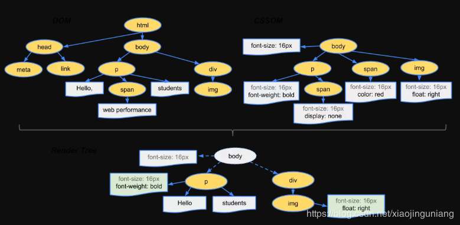

从输入URL到渲染出整个页面的过程包括三个部分：
1. DNS解析URL的过程
2. 浏览器发送请求与服务器交互的过程
3. 浏览器对接收到的html页面渲染的过程

#### 一、DNS解析URL的过程
DNS解析的过程就是寻找哪个服务器上有请求的资源。因为ip地址不容易记忆，一般会使用URL域名（如 www.baidu.com ）作为网址。<b>DNS解析就是将域名翻译成IP地址的过程。</b>

具体过程：
1. 浏览器缓存：浏览器会按照一定的频率 缓存DNS记录。
2. 操作系统缓存：如果浏览器缓存中找不到需要的DNS记录，就会取操作系统中找。
3. 路由缓存：路由器也有DNS缓存。
4. ISP的DNS服务器：ISP有专门的DNS服务器应对DNS查询请求。
5. 根服务器：ISP的DNS服务器找不到之后，就要向根服务器发出请求，进行递归查询。

#### 二、浏览器与服务器交互过程
1. 首先浏览器利用 <b>TCP协议</b>通过 <b>三次握手</b> 与服务器建立连接。
2. 浏览器根据解析到的IP地址和端口号 <b>发起http</b>的get<b>请求</b>。
3. 服务器接收到http请求之后，开始搜索html页面，并使用<b>http返回响应报文</b>。
4. 若状态码为200显示响应成功，浏览器接收到返回的html页面之后，开始进行页面的渲染。

##### TCP三次握手：
    1. 发送端首先发送一个带SYN标志的数据包给对方。
	2. 接收端收到后，回传一个带有SYN/ACK标志的数据包以示传达确认信息。 
	3. 最后，发送端再回传一个带ACK标志的数据包，代表“握手”结束。

http请求包括header和body。header中包括请求的方式（get和post）、请求的协议 （http、https、ftp）、请求的地址ip、缓存cookie。body中有请求的内容。 

#### 三、浏览器页面渲染过程
1. 浏览器根据深度遍历的方式把html节点遍历成dom 树。
2. 将css解析成CSS DOM树。
3. 将dom树和CSS DOM树构造成render树。
4. JS根据得到的render树 计算所有节点在屏幕中的位置，进行布局（回流）。
5. 遍历render树并调用硬件API绘制所有节点（重绘）。

###### 四、TCP四次挥手
断开一次TCP连接需要四次挥手：

1. 第一次挥手：主动关闭方发送一个FIN，用来关闭主动方到被动关闭方的数据传送，也就是主动关闭方告诉被动关闭方：我已经不 会再给你发数据了(当然，在fin包之前发送出去的数据，如果没有收到对应的ack确认报文，主动关闭方依然会重发这些数据)，但是，此时主动关闭方还可 以接受数据。
2. 第二次挥手：被动关闭方收到FIN包后，发送一个ACK给对方，确认序号为收到序号+1（与SYN相同，一个FIN占用一个序号）。
3. 第三次挥手：被动关闭方发送一个FIN，用来关闭被动关闭方到主动关闭方的数据传送，也就是告诉主动关闭方，我的数据也发送完了，不会再给你发数据了。
4. 第四次挥手：主动关闭方收到FIN后，发送一个ACK给被动关闭方，确认序号为收到序号+1，至此，完成四次挥手。

##### 补充： 构造render渲染树的过程

1. 从DOM树的根节点开始遍历每个可见的节点。
2. 对于每个可见的节点，找到CSS树中的对应的规则，并且应用他们。
3. 根据每个可见的节点及其对应的样式，组合生成渲染树。

##### TCP和UDP的区别
* TCP（Transmission Control Protocol，传输控制协议）是基于连接的协议，也就是说，在正式收发数据前，必须和对方建立可靠的连接。一个TCP连接必须要经过三次“对话”才能建立起来。
* UDP（User Data Protocol，用户数据报协议）是与TCP相对应的协议。它是面向非连接的协议，它不与对方建立连接，而是直接就把数据包发送过去！ 
* UDP适用于一次只传送少量数据、对可靠性要求不高的应用环境。

